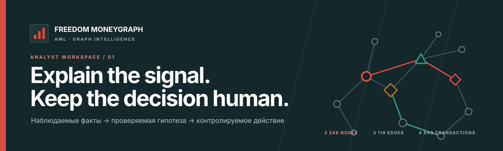
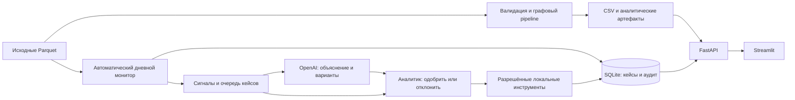

# 1. Freedom MoneyGraph AML

<p align="center">
  
</p>

**Для жюри:** [полный запуск](#run) · [демо-сценарий](#jury-demo) · [проверки](#checks) · [решение проблем](#troubleshooting) · [протокол реальных запусков](docs/verification_report.md).

Для полного сценария с ИИ нужен собственный OpenAI API key с доступом к `gpt-4o-mini` и доступной квотой. Без ключа работают pipeline, графовая аналитика, очередь по правилам и локальные инструменты, **но это не режим OpenAI**. Данные кейса уже находятся в репозитории; загружать транзакции вручную не требуется.

## 2. Какую проблему решает проект

**Кого из 2 248 клиентов проверить первым, почему и что делать дальше?** Freedom MoneyGraph AML помогает AML-аналитику разбирать обезличенную сеть внутрибанковских переводов: система сама обрабатывает данные, выделяет приоритетные сигналы и готовит варианты следующего шага. Аналитик проверяет доказательства, принимает решение и получает результат разрешённого локального действия.

Целевая аудитория — аналитики ПОД/ФТ и команды банковских расследований. Основной сценарий — не просмотр графиков ради графиков, а очередь проверяемых кейсов: **сигнал → объяснение → варианты действий → решение человека → результат и аудит**. Графы служат доказательствами и инструментом углублённой проверки.

Это работающая локальная версия для кейса «Граф денег». Проект не заявляет банковскую сертификацию, юридическое заключение или подтверждённое сокращение трудозатрат: такие эффекты требуют отдельного пилота.

## 3. Что реализовано

- Полный pipeline по исходным Parquet: проверка схемы и согласованности данных, направленный взвешенный граф, финансовые и временные признаки, роли, кластеры, приоритеты и объяснения.
- Шесть функциональных ролей: `consolidator`, `distributor`, `transit`, `coordinator`, `terminal`, `peripheral`. Числовое обоснование сохраняется для каждого узла; ограничения seed и четвёртого колена учитываются отдельно.
- Три обязательных CSV, расширенные Parquet-артефакты, отчёт валидации, manifest с длительностями этапов, версиями и хэшами входов/выходов.
- Автоматический мониторинг дат исходного файла: обнаружение сигналов, сохранение прогресса, приоритетная очередь и три предложения для каждого кейса. Не требуется вручную вводить ID клиента или составлять запрос, чтобы начать работу.
- OpenAI-слой для объяснения приоритетного кейса, ранжирования трёх безопасных действий и подготовки их обоснований. Ответ поступает как структурированный JSON, проходит серверную валидацию и ссылается на доступные числовые признаки. Отдельный AI Copilot отвечает на вопросы по аналитическим результатам. Обязательные роли и `priority_score` рассчитывает воспроизводимое локальное ядро, не LLM.
- Общий контроль платных AI-вызовов: постоянный кэш, дневная квота, учёт возвращённых провайдером токенов, защита от параллельных одинаковых запросов и пауза после ошибки. Нет бесконечного цикла агентов или пересылки всего датасета в LLM.
- Контролируемое исполнение после выбора аналитика: локальный черновик проверки ПОД/ФТ, наблюдаемый маршрут денег либо локальный список наблюдения.
- Журнал переходов мониторинга и расследования: сигнал, предложения, одобрение/отклонение, результат инструмента. Повторное одобрение с тем же ключом идемпотентности не создаёт дубликат результата.
- FastAPI, Streamlit-интерфейс, SQLite-хранилище кейсов и заметок; локальные подграфы, трассировка upstream/downstream, общие получатели и сценарная оценка связности сети при исключении узла.
- Тесты, проверка контрактов CSV, сквозной smoke-сценарий API/UI, Dockerfile и Docker Compose.

Ни монитор, ни LLM **не блокируют счета, не отменяют переводы и не отправляют сообщения в АФМ**. Черновик остаётся черновиком; название инструмента не означает соответствие официальному формату банковской отчётности.

## 4. Как работает решение

1. Pipeline читает все три файла из `data/`, проверяет их и формирует аналитический snapshot. Исходные файлы не изменяются.
2. После старта API фоновый сервис самостоятельно проходит календарные даты транзакций. Он ищет концентрацию плательщиков, значимый входящий поток и наблюдаемое быстрое перенаправление средств.
3. В `Agentic Loop` автоматически появляется приоритетный кейс: дата, узел, конкретные числовые признаки, ограничения выборки и варианты проверки. OpenAI включается для подходящих приоритетных кейсов при наличии настройки и доступного лимита; остальные остаются доступны в офлайн-режиме.
4. Аналитик читает объяснение и выбирает один из трёх вариантов. При необходимости открывает граф или трассировку, чтобы проверить гипотезу.
5. Для исполнения аналитик явно подтверждает выбор чекбоксом и кнопкой. API дополнительно проверяет подтверждение и ключ идемпотентности. Отклонение тоже записывается в журнал.
6. Сервер выполняет только разрешённый локальный инструмент и показывает результат вместе с audit receipt. Решение человека не передаётся модели.

| Предложение | Что получает аналитик после одобрения |
| --- | --- |
| Подготовить углублённую проверку | Investigation и скачиваемый Markdown-черновик с фактами, сохранённой AI-гипотезой, моделью и вопросами для проверки |
| Построить маршрут денег | Ограниченный подграф и наблюдаемые downstream-пути |
| Добавить связанные узлы в наблюдение | Локальный investigation/watchlist целевого узла и наблюдаемых плательщиков |

Мониторинг — **ускоренное воспроизведение исторических данных**, а не подключение к банковскому потоку в реальном времени. Прогресс сохраняется в SQLite. Период показа задаёт `AGENTIC_AUTO_MONITOR_CADENCE_SECONDS`, а `AGENTIC_AUTO_MONITOR_ENABLED=false` отключает фоновую обработку. Интерфейс обновляет очередь каждые три секунды.

Если OpenAI подключён после прежнего офлайн-запуска, монитор после обработки дат автоматически дополняет ожидающие приоритетные кейсы по одному за цикл. Уже принятые решения не переписываются. Кейс может остаться на правилах из-за порога, квоты или ошибки API — это явно видно в интерфейсе.

## 5. Технологии

| Задача | Реально используемые технологии |
| --- | --- |
| Язык и окружение | Python `>=3.11,<3.15`; для воспроизводимого локального запуска рекомендуется 3.12 |
| Данные | pandas, NumPy, PyArrow, SciPy, Parquet |
| Графовое ядро | NetworkX: направленные графы, центральности, Louvain-кластеры, пути и связность |
| API и конфигурация | FastAPI, Pydantic Settings, Uvicorn, YAML |
| Интерфейс | Streamlit, Plotly, HTTPX |
| Хранение | SQLAlchemy, SQLite |
| AI | OpenAI API через Python SDK; модель задаётся `OPENAI_MODEL`, пример настройки — `gpt-4o-mini` |
| Качество и поставка | pytest, pytest-cov, Ruff, mypy, Bash, Make, Docker Compose |

В репозитории также сохранён адаптер NVIDIA NIM для текстовых ответов, но структурированный разбор и ранжирование трёх действий в описанном здесь AI-сценарии используют OpenAI. Локальная аналитика не требует GPU или внешнего API. Обученной на этом кейсе ML-модели и размеченного ground truth нет: графовые роли и приоритеты задаются объяснимыми правилами и весами.

## 6. Архитектура проекта



AI находится вне критического пути обязательных выгрузок. Сервер определяет доступные действия; модель не может добавить произвольный инструмент или обойти одобрение. При недоступности провайдера приложение сохраняет локальный разбор и не выдаёт его за ответ OpenAI.

Для Agentic-карточки OpenAI возвращает краткое объяснение, ограничения и ровно три действия из серверного списка. `evidence_keys` проверяются на наличие во входных признаках. Это проверка структуры и ссылок на данные, **не автоматическое доказательство истинности текста модели**: аналитик сверяет формулировки с числами.

### Как ограничиваются расходы на AI

Сначала локальные правила просматривают все исходные транзакции. LLM вызывается для выбранных приоритетных случаев, а одинаковый запрос при неизменных данных, модели и версии prompt обслуживается из кэша. Общая квота распространяется и на автоматические разборы, и на AI Copilot.

| Настройка | Значение в `.env.example` | Назначение |
| --- | --- | --- |
| `AGENTIC_AI_MIN_PRIORITY_SCORE` | `0.55` | Минимальный локальный приоритет для автоматического AI-разбора |
| `AI_DAILY_CALL_LIMIT` | `100` | Максимум новых внешних вызовов за день UTC; `0` запрещает новые вызовы |
| `AI_CACHE_TTL_SECONDS` | `86400` | Срок хранения ответа кэша — 24 часа |
| `AI_STATE_PATH` | `./artifacts/ai_state.sqlite3` | Локальная БД кэша, резерваций вызовов и счётчиков |
| `AI_MAX_TOKENS` | `320` | Предел длины обычного ответа AI Copilot |
| `AI_TEMPERATURE` | `0` | Параметр генерации, не гарантия полной детерминированности LLM |

Структурированная карточка имеет отдельный предел 1 200 выходных токенов. SDK ограничен тайм-аутом 20 секунд и не делает автоматические повторы; после ошибки действует пауза 60 секунд. Кэш и квота сохраняются между перезапусками API, если сохранён файл состояния. Новые вызовы сначала резервируют квоту в SQLite; неуспешные попытки тоже расходуют лимит вызовов, поскольку провайдер мог принять запрос.

При исчерпании квоты, ошибке модели или недоступности учёта расходов включается офлайн-разбор. Это ограничитель числа запросов, **не долларовый бюджет и не банковская выписка**: токены без ответа провайдера могут не попасть в локальный счётчик. Денежные лимиты дополнительно устанавливаются в аккаунте OpenAI.

```text
data/                       исходные материалы кейса
config/default.yaml         версии параметров, веса и пороги правил
src/moneygraph/              аналитическое ядро и приложение
  ai/                       провайдеры и AI-контекст
  api/                      HTTP-маршруты и схемы
  services/                 мониторинг, Agentic Loop, аналитические сервисы
  repository/               сохранение кейсов, решений и аудита
  ui/                       рабочее место аналитика
out/                        обязательные CSV, manifest и отчёты
artifacts/                  расширенные вычисленные признаки
tests/                      unit-, integration- и сквозные тесты
scripts/                    pipeline, verifier и smoke-проверка
docs/                       методология, архитектура и материалы демонстрации
```

Параметры ядра находятся в [config/default.yaml](config/default.yaml), формулы и оговорки — в [методологии](docs/methodology.md). Подробности: [архитектура](docs/architecture.md), [граница исполнения Agentic Loop](docs/agentic_loop.md), [безопасность](docs/security.md), [план масштабирования](docs/scaling.md).

<a id="run"></a>

## 7. Установка и запуск

**Рекомендуемый путь для жюри — шаги 1–5 ниже.** Команды рассчитаны на macOS/Linux (на Windows — WSL2). Нужны Python 3.12 с `venv`/`pip`, `make`, доступ к интернету для установки пакетов и вызовов OpenAI. GPU, Node.js, отдельный сервер БД и настройка Agents/Sandbox в OpenAI не требуются. Docker — альтернативный способ запуска, не обязательный компонент.

### Шаг 1. Открыть репозиторий и установить зависимости

Скачайте или клонируйте этот репозиторий и откройте терминал **в его корне**, где находятся `pyproject.toml` и `Makefile`:

```bash
python3.12 --version
make --version
ls data/nodes.parquet data/edges.parquet data/transactions.parquet

# Для первого запуска; существующее окружение не пересоздаём.
test -x .venv/bin/python || python3.12 -m venv .venv
.venv/bin/python -m pip install -e ".[dev,ai]"
.venv/bin/python -m pip check
.venv/bin/python -c "import moneygraph, openai, uvicorn, streamlit; print('Dependencies OK')"
```

`[ai]` устанавливает OpenAI SDK, `[dev]` — инструменты проверки. Не заменяйте эту команду установкой только `starter/requirements.txt`: `starter/` не является готовым приложением. Активировать `.venv` необязательно: во всех командах явно указан её Python. Если в уже существующем uv-окружении нет `pip`, используйте `uv pip install --python .venv/bin/python -e ".[dev,ai]"` и `uv pip check --python .venv/bin/python`.

### Шаг 2. Включить настоящий OpenAI

```bash
test -f .env || cp .env.example .env
chmod 600 .env
```

Откройте **`.env` в редакторе** и измените существующие строки, не добавляя дубликаты:

```dotenv
AI_ENABLED=true
AI_PROVIDER=openai
OPENAI_MODEL=gpt-4o-mini
OPENAI_API_KEY=ВСТАВЬТЕ_СВОЙ_КЛЮЧ_ЛОКАЛЬНО
AI_DAILY_CALL_LIMIT=100
AI_STATE_PATH=./artifacts/ai_state.sqlite3
AGENTIC_AI_MIN_PRIORITY_SCORE=0.55
AGENTIC_AUTO_MONITOR_ENABLED=true
AGENTIC_AUTO_MONITOR_CADENCE_SECONDS=2
```

**Важно:** в `.env.example` намеренно стоит `AI_ENABLED=false`. Одна установка SDK или копирование файла не включает ИИ. Замените строку-заполнитель ключа настоящим ключом; настройка ключа описана в [официальном quickstart OpenAI](https://developers.openai.com/api/docs/quickstart). Не меняйте остальные пути из `.env.example` для первого запуска.

После старта API автоматический анализ может расходовать токены без ручного запроса. `100` — общий дневной предел новых вызовов приложения, не сумма в долларах. Ограничения и кэш описаны в разделе 6. Для проверки **без внешнего ИИ и расходов** оставьте `AI_ENABLED=false`; все остальные шаги те же.

Ключ использует backend. `.env` исключён из Git; не вставляйте ключ в чат, README, командную строку или скриншот. Если ключ был опубликован, отзовите его и создайте новый. Автоматический разбор передаёт OpenAI псевдонимный ID, разрешённые коды правил и числовые агрегаты, а не весь датасет или список плательщиков. AI Copilot также передаёт введённый вопрос: не вводите секреты и персональные данные. Внешний режим используйте только при наличии права передавать этот контекст провайдеру.

### Шаг 3. Выполнить pipeline на всём датасете

```bash
PYTHON=.venv/bin/python make analyze
.venv/bin/python scripts/verify_outputs.py --out ./out --expected-nodes 2248
```

Ожидаемый результат verifier: `OK: mandatory outputs in out satisfy the contract`.
Создаются `out/nodes_roles.csv` (2 248 строк), `out/clusters.csv` (88), `out/top_nodes.csv` (50), manifest и аналитические артефакты. Заголовки CSV не включены в число строк. Исходные `data/*.parquet` не меняются; при повторном запуске вычисленные файлы в `out/` и `artifacts/` обновляются.

Pipeline не вызывает OpenAI. **`make dev` сам не рассчитывает CSV**: на новом компьютере этот шаг нужно выполнить до запуска UI. Для запуска без Make используйте эквивалентную команду:

```bash
.venv/bin/python -m moneygraph.cli analyze \
  --data ./data --out ./out --artifacts ./artifacts \
  --database-url sqlite:///./moneygraph.db
```

### Шаг 4. Запустить API и UI вместе

```bash
PYTHON=.venv/bin/python make dev
```

Оставьте этот терминал открытым. `make dev` загружает `.env` в API и запускает UI, подключённый к тому же API. Остановка — `Ctrl+C`; повторный запуск — та же команда. После изменения ключа, модели или лимитов **перезапустите API**: обновление вкладки браузера настройки процесса не меняет.

| Что открыть | Адрес |
| --- | --- |
| Интерфейс аналитика | [http://127.0.0.1:8501](http://127.0.0.1:8501) |
| Документация API / Swagger | [http://127.0.0.1:8000/docs](http://127.0.0.1:8000/docs) |
| Состояние API и счётчики AI | [http://127.0.0.1:8000/health](http://127.0.0.1:8000/health) |

Порты заняты? Выберите свободную пару, например:

```bash
PYTHON=.venv/bin/python API_PORT=18011 UI_PORT=18511 \
CORS_ORIGINS=http://127.0.0.1:18511,http://localhost:18511 make dev
```

Тогда UI находится на `http://127.0.0.1:18511`, Swagger — на `http://127.0.0.1:18011/docs`. Не останавливайте неизвестные процессы ради освобождения порта.

<details>
<summary>Без Make: API и UI в двух терминалах</summary>

Оба терминала должны быть открыты в корне репозитория. В первом:

```bash
.venv/bin/python -m uvicorn moneygraph.api.main:app \
  --env-file .env --host 127.0.0.1 --port 8000
```

Во втором:

```bash
MONEYGRAPH_API_URL=http://127.0.0.1:8000 \
.venv/bin/python -m streamlit run src/moneygraph/ui/app.py \
  --server.address 127.0.0.1 --server.port 8501 \
  --server.headless true --browser.gatherUsageStats false
```

Остановите каждый процесс через `Ctrl+C`. `uvicorn` и `streamlit` глобально устанавливать не нужно.

</details>

### Шаг 5. Убедиться, что работает именно нужный режим

Откройте UI → **Agentic Loop**. Монитор сам читает все 4 840 транзакций по датам, сохраняет сигналы и выбирает кейс; вручную вводить GID или нажимать «Ручной replay» не нужно. Значение «каждые 2 секунды» — пауза между шагами, а не обещание времени полного прохода: вычисления и запросы модели занимают дополнительное время.

- В `Мониторинг` увеличивается число обработанных дат; для набора кейса итог — `31 / 31`.
- В `Реальная работа ИИ` указаны `gpt-4o-mini`, успешные ответы, фактические токены и время последнего успеха. Статус «настроен» при нуле ответов ещё не подтверждает OpenAI.
- В карточке подходящего кейса появляется сохранённый разбор OpenAI, а у предложений — AI-обоснования. Низкоприоритетные кейсы и кейсы при исчерпании квоты могут остаться на правилах: это явно подписано.
- Выполните [демо-сценарий ниже](#jury-demo): подтвердите действие, получите документ и проверьте аудит.

Без дополнительных платных запросов проверить состояние из второго терминала можно так:

```bash
curl --fail --silent --show-error http://127.0.0.1:8000/health \
  | .venv/bin/python -m json.tool
```

Проверьте `data.status`, `data.artifacts` и `data.ai_runtime`. Для успешного AI-разбора важны `successful_calls > 0`, `last_success_at` и usage, а не только HTTP 200. При нестандартном порте измените URL.

### Где хранятся результаты и как продолжить работу

По умолчанию `moneygraph.db` хранит кейсы, прогресс replay и решения; `artifacts/ai_state.sqlite3` — кэш и счётчики внешних вызовов. Повторный старт продолжает работу, не обнуляя аудит и квоту. Если даты уже пройдены, монитор дополняет подходящие нерешённые кейсы AI-разбором; завершённые решения не переписывает.

Не удаляйте БД для обхода квоты. После `budget_exhausted` автоматический повтор соответствующих кейсов запланирован на следующие сутки UTC; простое повышение лимита не сбрасывает уже сохранённое время повтора. Для отдельного нового демонстрационного расследования можно выбрать **новое** имя БД через `DATABASE_URL=sqlite:///./artifacts/jury-demo.db PYTHON=.venv/bin/python make dev`, сохранив прежний `AI_STATE_PATH` и общий учёт вызовов.

### Docker — альтернативный путь

Нужны работающий Docker Engine/Desktop и Docker Compose v2. Сначала выполните настройку `.env` из шага 2; без неё контейнеры работают без внешнего ИИ. Системные Python/Make для этого варианта не нужны:

```bash
mkdir -p out artifacts
docker compose config --quiet
APP_UID="$(id -u)" APP_GID="$(id -g)" docker compose up --build
```

Запускайте от обычного пользователя, не root: UID/GID нужны для записи в локальные `out/` и `artifacts/` на Linux. Compose сам выполняет `analyzer`, затем запускает API и UI на портах 8000/8501. Исходные данные монтируются read-only; процессы не root, порты доступны только локально. Не запускайте Docker и локальный вариант на одних портах одновременно.

Диагностика: `docker compose ps` и `docker compose logs --tail=100 analyzer api ui`. Остановка — `docker compose down` **без `-v`**, чтобы сохранить БД в named volume; результаты остаются в `out/` и `artifacts/`. В Compose путь AI-состояния фиксирован: `/app/artifacts/ai_state.sqlite3`.

Не публикуйте вывод `docker compose config` без `--quiet`: он может содержать ключ. В последней проверке валидировалась конфигурация Compose; сборка образа не подтверждена. Основной проверенный путь — локальная установка выше.

<a id="troubleshooting"></a>

### Если что-то не запускается

| Симптом | Что проверить / сделать |
| --- | --- |
| `python3.12: command not found` | Установите Python 3.12. Если он доступен как `python3`, проверьте версию и используйте это имя только для создания `.venv`. |
| `uvicorn: command not found` / нет `moneygraph` | Запускайте из корня через `.venv/bin/python -m uvicorn`, после `pip install -e ".[dev,ai]"`. |
| `No module named openai` / `sdk_missing` | Установите `[ai]` из шага 1 **в тот Python, которым запущен API**, затем перезапустите API. |
| Найден только `.env.example` | Создайте `.env` командой шага 2. Файл-пример сам по себе настройки не включает. |
| `artifacts_unavailable`, пустые графики или HTTP 503 | Сначала выполните pipeline и verifier. Запускайте процессы из корня; проверьте `OUT_DIR`/`ARTIFACTS_DIR`. |
| AI offline, хотя `.env` заполнен | Проверьте `AI_ENABLED=true`, модель и запуск с `--env-file .env`. Переменные, ранее экспортированные в терминале, имеют приоритет над `.env`. |
| `authentication_failed` / `invalid_request` | Проверьте действующий ключ, доступ к выбранной модели и её имя. Не отправляйте ключ в issue или чат. |
| `insufficient_quota` / `rate_limited` | Это ответ OpenAI: проверьте квоту/биллинг или дождитесь снятия rate limit. Локальный `AI_DAILY_CALL_LIMIT` эту проблему не исправляет. |
| Дневной лимит приложения исчерпан | Сверьте `requests_today`, `daily_call_limit`, UTC-дату и `AI_STATE_PATH`. Кэш и готовые карточки доступны. Лимит 20 в протоколе — настройка конкретной проверки; стандарт `.env.example` — 100. |
| `Address already in use` / UI обращается к старому API | Выберите свободные порты командой шага 4 и откройте соответствующий URL. |
| `timeout` / `provider_unavailable` | Проверьте соединение с OpenAI; причина показывается в AI-статусе. Приложение сохраняет режим правил, не выдавая его за LLM. |

У Make значения `DATA_DIR`, `OUT_DIR`, `ARTIFACTS_DIR` и `DATABASE_URL` берутся из Make-параметров/окружения; для нестандартных путей передавайте их в команду `make` явно. Для первого запуска оставьте стандартные пути во всех компонентах.

## 8. Как проверить решение

<a id="jury-demo"></a>

### Демо для жюри за пять минут

1. Выполните pipeline и проверку CSV из раздела 7. Откройте UI → `Agentic Loop`; дождитесь появления автоматически выбранного кейса. Даты и `gid` вручную вводить не нужно.
2. На вкладке `Мониторинг` покажите источник, прогресс по датам и очередь. На `Alert + Explain` сопоставьте суммы/связи с фактами, причинами сигнала и ограничениями данных.
3. В блоке `Реальная работа ИИ` проверьте модель, время последнего успешного ответа, число вызовов/ответов из кэша, возвращённые токены и остаток квоты. У конкретного кейса различаются сохранённый разбор модели, кэш и правила. Само наличие ключа или включённого флага ещё не доказывает успешный вызов модели.
4. В `Decision Support` сравните три предложения и их числовые основания. На `Approve → Execute → Audit` выберите «Подготовить черновик для внутренней AML-проверки»: без чекбокса Approve недоступен. Подтвердите факты, нажмите `Approve и исполнить`.
5. Откройте квитанцию, прочитайте документ и нажмите `Скачать черновик AML (.md)`. Проверьте в нём GID, дату, суммы, AI-гипотезу, модель и ограничения. В журнале появятся `action.approved` и `tool.executed`; повторное исполнение отключено. Затем на другом ещё не решённом предложении проверьте `Reject`: инструмент не должен запускаться.

**Что считается успешной демонстрацией:** данные обработаны без ручного ввода кейсов → есть подтверждённый ответ OpenAI → аналитик выбрал шаг → получен скачиваемый локальный результат → решение и исполнение есть в аудите. Ни блокировки денег, ни внешней отправки документа нет. «Пять минут» — сценарий показа после установки и запуска, не обещание времени установки зависимостей и всех внешних вызовов.

Презентационные материалы: [демо-сценарий](docs/demo_script.md), [тезисы защиты](docs/jury_pitch.md). Заявляемая ценность демонстрируется воспроизводимым переходом от сигнала к результату проверки, а не неподтверждёнными обещаниями точности или победы.

<a id="checks"></a>

### Автоматические проверки без оплаты OpenAI

```bash
.venv/bin/python -m pytest -q --cov=moneygraph --cov-report=term --cov-fail-under=80
.venv/bin/python -m ruff check .
.venv/bin/python -m mypy src
.venv/bin/python scripts/verify_outputs.py --out ./out --expected-nodes 2248
env -u DATABASE_URL PYTHON=.venv/bin/python API_PORT=18005 UI_PORT=18505 make smoke
```

Smoke-проверка запускает отдельные API/UI с временной БД, проверяет health и проходит `scan → proposals → reject → approve → local execution → audit`, включая идемпотентный повтор. `env -u DATABASE_URL` исключает случайное использование ранее экспортированной рабочей БД; по завершении smoke останавливает свои процессы и удаляет свои временные данные. Она принудительно отключает внешний AI и не расходует токены; успешный smoke **не является** проверкой доступности OpenAI. Порты 18005/18505 должны быть свободны.

Для живой проверки OpenAI запустите приложение с новым рабочим ключом, дождитесь подходящего кейса и убедитесь, что счётчик успешных ответов увеличился, а карточка получила структурированное объяснение и обоснования. Это реальный платный запрос. Повторный одинаковый запрос в пределах TTL должен использовать кэш, а не новый вызов. Сведения об AI доступны также в `data.ai_runtime` ответов `/health` и `/api/v1/agentic/monitoring`.

Отсутствие SDK, ошибка ключа, исчерпание квоты, rate limit, timeout и ошибка параметров показываются отдельно. Наличие ключа само по себе не считается успешным подключением. Устанавливайте extra `[ai]` и запускайте Uvicorn именно из `.venv` с `--env-file .env`; иначе приложение может остаться без SDK или настроек.

Полная команда локальной верификации: `env -u DATABASE_URL PYTHON=.venv/bin/python API_PORT=18005 UI_PORT=18505 make verify`. Она запускает lint, typecheck, тесты без маркера `full_data`, pipeline на полном наборе, проверку CSV и smoke. Команда обновляет вычисленные `out/` и `artifacts/`; полный pytest, включая `full_data`, приведён отдельной командой выше.

### Дополнительный живой запрос из Swagger

При включённом OpenAI и положительном остатке квоты откройте Swagger → `POST /api/v1/assistant/query` → `Try it out`. Возьмите GID из карточки или используйте присутствующий в исходном наборе пример:

```json
{
  "query": "Объясни приоритет проверки узла по метрикам и предложи два пункта проверки. Не делай вывод о нарушении.",
  "gids": ["100000002547110100"]
}
```

Успех модели: `data.provider = "openai"`, `data.fallback = false`, есть `data.model`, `data.answer` и `data.usage`. У первого нового запроса `data.cached = false`; у повтора с тем же контекстом в пределах TTL — `true`, без нового внешнего вызова. Если этот запрос уже выполняли ранее, кэш может сработать сразу. Показанный в кэшированном ответе `usage` относится к исходной генерации; он не означает повторное списание. Новые платные вызовы учитываются в `data.ai_runtime` ответа `/health`.

### Что проверять в результатах

| Файл | Строк без заголовка в текущем наборе | Обязательные колонки |
| --- | ---: | --- |
| `out/nodes_roles.csv` | 2 248 | `gid, role, role_score, cluster_id, priority_score, evidence` |
| `out/clusters.csv` | 88 | `cluster_id, n_nodes, n_seed, sum_kzt_internal, top_gids, hypothesis` |
| `out/top_nodes.csv` | 50 | `rank, gid, role, priority_score, why` |

Все узлы должны присутствовать, объяснения — содержать числа, top — быть отсортированным по приоритету. Роли, кластеры и обязательные объяснения формируются офлайн. Фиксированный seed и стабильная сортировка позволяют сравнивать хэши повторных запусков при неизменных данных, конфигурации и окружении.

Фактическое внутреннее время, длительности этапов, версии библиотек и SHA-256 находятся в `out/run_manifest.json`; результаты входной проверки — в `out/validation_report.json`. Для замера полного времени процесса:

```bash
/usr/bin/time -p .venv/bin/python -m moneygraph.cli analyze \
  --data ./data --out ./out --artifacts ./artifacts \
  --database-url sqlite:///./moneygraph.db
```

Ненулевой код завершения теста или verifier означает, что проверка не пройдена. README не подменяет свежий протокол выполнения сохранёнными историческими цифрами.

Результаты выполненной проверки от 23 сентября 2026 года, фактические команды,
время pipeline, живые OpenAI-вызовы и фактический token usage — в [протоколе проверки](docs/verification_report.md).
Это доказательства конкретного запуска, а не обещание одинаковой скорости и token usage на другом компьютере. Указанные там временные пути и порты 18009/18509 не нужны для стандартного запуска жюри.

## 9. Данные и интеграции

| Исходник кейса | Содержимое | Объём |
| --- | --- | ---: |
| `data/nodes.parquet` | Узлы, глубина обхода и признак seed | 2 248 узлов |
| `data/edges.parquet` | Агрегированные направленные связи | 3 119 рёбер |
| `data/transactions.parquet` | Отдельные переводы с датами | 4 840 операций |

Период — **1–31 июля 2026 года**, исходных seed — **81**, глубина — **4 колена**, минимальная сумма — **5 000 KZT**. Рабочий pipeline и автоматический монитор читают именно эти файлы. Синтетические данные в `tests/` нужны для проверок и не подмешиваются в результат кейса.

Единственная необходимая внешняя интеграция для описанного LLM-режима — OpenAI API. Подключений к DWH, банковским счетам, санкционным спискам или АФМ нет. Локальный HTTP API документирован в Swagger; основные точки доступа:

- `/health` — состояние приложения;
- `/api/v1/summary`, `/api/v1/top-nodes`, `/api/v1/nodes/{gid}` — аналитические результаты;
- `/api/v1/agentic/monitoring` — фоновый монитор и очередь;
- `/api/v1/agentic/actions/{action_id}/decision` — решение по предложению;
- `/api/v1/agentic/audit` — журнал переходов;
- `/api/v1/investigations` — локальные кейсы.

## 10. Ограничения и дальнейшее развитие

- **Дневная точность данных.** Нельзя подтвердить `dwell < 2h` или обнаружение «за последние два часа». Используется наблюдаемое перенаправление за 0–2 календарных дня; исторический replay маркируется как симуляция.
- **Неполный граф.** На глубине 4 отсутствие исходящих связей не доказывает оседание денег. Внешние входящие seed не видны, а операции ниже 5 000 KZT исключены. Полные балансы клиентов неизвестны.
- **Нет ground truth.** Роль, `role_score`, `priority_score` и рекомендация — аналитические гипотезы, не вероятность преступления и не юридический вывод. Accuracy/F1 по этому набору не заявлены.
- **Ограниченная автономность намеренна.** Система автоматизирует обнаружение и подготовку, но не принимает окончательное решение за аналитика. Поддерживаются только три локальных инструмента; произвольные команды, официальная отправка STR/SAR и банковские ограничения не реализованы.
- **LLM может ошибаться или быть недоступен.** Ключ, доступ к модели, сеть и лимиты провайдера нужны для OpenAI-ответов. Не каждый alert обязательно проходит LLM-анализ; локальный fallback сохраняет работоспособность, но не заменяет подтверждение качества модели.
- **Локальная безопасность, не промышленный IAM.** `ANALYST_NAME` — метка аудита, а не аутентификация. Нет SSO/RBAC, maker-checker, защищённого от изменения audit storage, банковского secrets manager и сертифицированной интеграции. Не публикуйте этот API напрямую в интернет.
- **Масштабирование не проверено на миллионах узлов.** Текущая версия использует NetworkX и SQLite. Переход к partitioned-хранилищу, очередям задач, инкрементальным признакам, более компактному графовому движку и промышленной БД описан как следующий этап, а не готовая функция.

До банковского пилота необходимы оценка качества правил/LLM на размеченных кейсах, проверка приватности внешнего AI, роли доступа, неизменяемый аудит, резервное копирование и договорённость о форматах/полномочиях интеграций. Подробнее — [безопасность](docs/security.md) и [масштабирование](docs/scaling.md).

## 11. Развёрнутая версия

Публичная deployed-версия в репозитории не подтверждена. Основной способ проверки — [полный локальный запуск](#run): [UI на 8501](http://127.0.0.1:8501) и [API/Swagger на 8000](http://127.0.0.1:8000/docs). Это адреса компьютера, на котором запущен проект, а не публичные ссылки. Ключи, виртуальное окружение, рабочие БД и вычисленные артефакты не поставляются через Git: зависимости, `.env` и результаты создаются шагами 1–3; три исходных Parquet входят в репозиторий.
