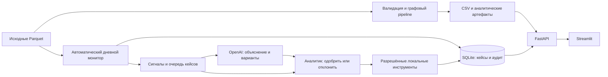

# 1. Freedom MoneyGraph AML

<p align="center">
  
</p>

## 2. Какую проблему решает проект

**Кого из 2 248 клиентов проверить первым, почему и что делать дальше?** Freedom MoneyGraph AML помогает AML-аналитику разбирать обезличенную сеть внутрибанковских переводов: система сама обрабатывает данные, выделяет приоритетные сигналы и готовит варианты следующего шага. Аналитик проверяет доказательства, принимает решение и получает результат разрешённого локального действия.

Целевая аудитория — аналитики ПОД/ФТ и команды банковских расследований. Основной сценарий — не просмотр графиков ради графиков, а очередь проверяемых кейсов: **сигнал → объяснение → варианты действий → решение человека → результат и аудит**. Графы служат доказательствами и инструментом углублённой проверки.

Это работающая локальная версия для кейса «Граф денег». Проект не заявляет банковскую сертификацию, юридическое заключение или подтверждённое сокращение трудозатрат: такие эффекты требуют отдельного пилота.

## 3. Что реализовано

- Полный pipeline по исходным Parquet: проверка схемы и согласованности данных, направленный взвешенный граф, финансовые и временные признаки, роли, кластеры, приоритеты и объяснения.
- Шесть функциональных ролей: `consolidator`, `distributor`, `transit`, `coordinator`, `terminal`, `peripheral`. Числовое обоснование сохраняется для каждого узла; ограничения seed и четвёртого колена учитываются отдельно.
- Три обязательных CSV, расширенные Parquet-артефакты, отчёт валидации, manifest с длительностями этапов, версиями и хэшами входов/выходов.
- Автоматический мониторинг дат исходного файла: обнаружение сигналов, сохранение прогресса, приоритетная очередь и три предложения для каждого кейса. Не требуется вручную вводить ID клиента или составлять запрос, чтобы начать работу.
- OpenAI-слой для объяснения приоритетного кейса, ранжирования трёх безопасных действий и подготовки их обоснований. Ответ поступает как структурированный JSON, проходит серверную валидацию и ссылается на доступные числовые признаки. Отдельный AI Copilot отвечает на вопросы по аналитическим результатам. Обязательные роли и `priority_score` рассчитывает воспроизводимое локальное ядро, не LLM.
- Общий контроль платных AI-вызовов: постоянный кэш, дневная квота, учёт возвращённых провайдером токенов, защита от параллельных одинаковых запросов и пауза после ошибки. Нет бесконечного цикла агентов или пересылки всего датасета в LLM.
- Контролируемое исполнение после выбора аналитика: локальный черновик проверки ПОД/ФТ, наблюдаемый маршрут денег либо локальный список наблюдения.
- Журнал переходов мониторинга и расследования: сигнал, предложения, одобрение/отклонение, результат инструмента. Повторное одобрение с тем же ключом идемпотентности не создаёт дубликат результата.
- FastAPI, Streamlit-интерфейс, SQLite-хранилище кейсов и заметок; локальные подграфы, трассировка upstream/downstream, общие получатели и сценарная оценка связности сети при исключении узла.
- Тесты, проверка контрактов CSV, сквозной smoke-сценарий API/UI, Dockerfile и Docker Compose.

Ни монитор, ни LLM **не блокируют счета, не отменяют переводы и не отправляют сообщения в АФМ**. Черновик остаётся черновиком; название инструмента не означает соответствие официальному формату банковской отчётности.

## 4. Как работает решение

1. Pipeline читает все три файла из `data/`, проверяет их и формирует аналитический snapshot. Исходные файлы не изменяются.
2. После старта API фоновый сервис самостоятельно проходит календарные даты транзакций. Он ищет концентрацию плательщиков, значимый входящий поток и наблюдаемое быстрое перенаправление средств.
3. В `Agentic Loop` автоматически появляется приоритетный кейс: дата, узел, конкретные числовые признаки, ограничения выборки и варианты проверки. OpenAI включается для подходящих приоритетных кейсов при наличии настройки и доступного лимита; остальные остаются доступны в офлайн-режиме.
4. Аналитик читает объяснение и выбирает один из трёх вариантов. При необходимости открывает граф или трассировку, чтобы проверить гипотезу.
5. Для исполнения аналитик явно подтверждает выбор чекбоксом и кнопкой. API дополнительно проверяет подтверждение и ключ идемпотентности. Отклонение тоже записывается в журнал.
6. Сервер выполняет только разрешённый локальный инструмент и показывает результат вместе с audit receipt. Решение человека не передаётся модели.

| Предложение | Что получает аналитик после одобрения |
| --- | --- |
| Подготовить углублённую проверку | Investigation и локальный черновик с фактами и вопросами для проверки |
| Построить маршрут денег | Ограниченный подграф и наблюдаемые downstream-пути |
| Добавить связанные узлы в наблюдение | Локальный investigation/watchlist целевого узла и наблюдаемых плательщиков |

Мониторинг — **ускоренное воспроизведение исторических данных**, а не подключение к банковскому потоку в реальном времени. Прогресс сохраняется в SQLite. Период показа задаёт `AGENTIC_AUTO_MONITOR_CADENCE_SECONDS`, а `AGENTIC_AUTO_MONITOR_ENABLED=false` отключает фоновую обработку. Интерфейс обновляет очередь каждые три секунды.

Если OpenAI подключён после прежнего офлайн-запуска, монитор после обработки дат автоматически дополняет ожидающие приоритетные кейсы по одному за цикл. Уже принятые решения не переписываются. Кейс может остаться на правилах из-за порога, квоты или ошибки API — это явно видно в интерфейсе.

## 5. Технологии

| Задача | Реально используемые технологии |
| --- | --- |
| Язык и окружение | Python `>=3.11,<3.15`; для воспроизводимого локального запуска рекомендуется 3.12 |
| Данные | pandas, NumPy, PyArrow, SciPy, Parquet |
| Графовое ядро | NetworkX: направленные графы, центральности, Louvain-кластеры, пути и связность |
| API и конфигурация | FastAPI, Pydantic Settings, Uvicorn, YAML |
| Интерфейс | Streamlit, Plotly, HTTPX |
| Хранение | SQLAlchemy, SQLite |
| AI | OpenAI API через Python SDK; модель задаётся `OPENAI_MODEL`, пример настройки — `gpt-4o-mini` |
| Качество и поставка | pytest, pytest-cov, Ruff, mypy, Bash, Make, Docker Compose |

В репозитории также сохранён адаптер NVIDIA NIM, но основной описанный здесь AI-сценарий использует OpenAI. Локальная аналитика не требует GPU или внешнего API. Обученной на этом кейсе ML-модели и размеченного ground truth нет: графовые роли и приоритеты задаются объяснимыми правилами и весами.

## 6. Архитектура проекта



AI находится вне критического пути обязательных выгрузок. Сервер определяет доступные действия; модель не может добавить произвольный инструмент или обойти одобрение. При недоступности провайдера приложение сохраняет локальный разбор и не выдаёт его за ответ OpenAI.

Для Agentic-карточки OpenAI возвращает краткое объяснение, ограничения и ровно три действия из серверного списка. `evidence_keys` проверяются на наличие во входных признаках. Это проверка структуры и ссылок на данные, **не автоматическое доказательство истинности текста модели**: аналитик сверяет формулировки с числами.

### Как ограничиваются расходы на AI

Сначала локальные правила просматривают все исходные транзакции. LLM вызывается для выбранных приоритетных случаев, а одинаковый запрос при неизменных данных, модели и версии prompt обслуживается из кэша. Общая квота распространяется и на автоматические разборы, и на AI Copilot.

| Настройка | Значение в `.env.example` | Назначение |
| --- | --- | --- |
| `AGENTIC_AI_MIN_PRIORITY_SCORE` | `0.55` | Минимальный локальный приоритет для автоматического AI-разбора |
| `AI_DAILY_CALL_LIMIT` | `100` | Максимум новых внешних вызовов за день UTC; `0` запрещает новые вызовы |
| `AI_CACHE_TTL_SECONDS` | `86400` | Срок хранения ответа кэша — 24 часа |
| `AI_STATE_PATH` | `./artifacts/ai_state.sqlite3` | Локальная БД кэша, резерваций вызовов и счётчиков |
| `AI_MAX_TOKENS` | `320` | Предел длины обычного ответа AI Copilot |
| `AI_TEMPERATURE` | `0` | Параметр генерации, не гарантия полной детерминированности LLM |

Структурированная карточка имеет отдельный предел 1 200 выходных токенов. SDK ограничен тайм-аутом 20 секунд и не делает автоматические повторы; после ошибки действует пауза 60 секунд. Кэш и квота сохраняются между перезапусками API, если сохранён файл состояния. Новые вызовы сначала резервируют квоту в SQLite; неуспешные попытки тоже расходуют лимит вызовов, поскольку провайдер мог принять запрос.

При исчерпании квоты, ошибке модели или недоступности учёта расходов включается офлайн-разбор. Это ограничитель числа запросов, **не долларовый бюджет и не банковская выписка**: токены без ответа провайдера могут не попасть в локальный счётчик. Денежные лимиты дополнительно устанавливаются в аккаунте OpenAI.

```text
data/                       исходные материалы кейса
config/default.yaml         версии параметров, веса и пороги правил
src/moneygraph/              аналитическое ядро и приложение
  ai/                       провайдеры и AI-контекст
  api/                      HTTP-маршруты и схемы
  services/                 мониторинг, Agentic Loop, аналитические сервисы
  repository/               сохранение кейсов, решений и аудита
  ui/                       рабочее место аналитика
out/                        обязательные CSV, manifest и отчёты
artifacts/                  расширенные вычисленные признаки
tests/                      unit-, integration- и сквозные тесты
scripts/                    pipeline, verifier и smoke-проверка
docs/                       методология, архитектура и материалы демонстрации
```

Параметры ядра находятся в [config/default.yaml](config/default.yaml), формулы и оговорки — в [методологии](docs/methodology.md). Подробности: [архитектура](docs/architecture.md), [граница исполнения Agentic Loop](docs/agentic_loop.md), [безопасность](docs/security.md), [план масштабирования](docs/scaling.md).

## 7. Установка и запуск

Команды выполняются из корня репозитория. Нужны Python 3.12, `venv`, `pip` и `make`; исходные файлы кейса должны находиться в `data/`.

### Локальная установка

```bash
python3.12 -m venv .venv
.venv/bin/python -m pip install -e ".[dev,ai]"
PYTHON=.venv/bin/python make analyze
.venv/bin/python scripts/verify_outputs.py --out ./out --expected-nodes 2248
```

Эквивалентный прямой запуск pipeline:

```bash
.venv/bin/python -m moneygraph.cli analyze \
  --data ./data --out ./out --artifacts ./artifacts \
  --database-url sqlite:///./moneygraph.db
```

### Подключение OpenAI

Создайте локальный файл настроек, не перезаписывая существующий:

```bash
test -f .env || cp .env.example .env
chmod 600 .env
```

В редакторе заполните `.env`:

```dotenv
AI_ENABLED=true
AI_PROVIDER=openai
OPENAI_MODEL=gpt-4o-mini
OPENAI_API_KEY=ВСТАВЬТЕ_СВОЙ_НОВЫЙ_КЛЮЧ_ЛОКАЛЬНО
AGENTIC_AUTO_MONITOR_ENABLED=true
AGENTIC_AUTO_MONITOR_CADENCE_SECONDS=2
```

Ключ передаётся только backend-процессу. `.env` исключён из Git; не вставляйте ключ в чат, README или скриншот. Если ключ уже был опубликован, отзовите его и создайте новый. Не публикуйте вывод `docker compose config` с подставленными секретами; для проверки используйте `--quiet`.

Автоматический AI-разбор получает псевдонимный ID, разрешённые коды правил и числовые агрегаты, а не весь файл транзакций, заметки или список плательщиков. AI Copilot дополнительно передаёт введённый пользователем вопрос и минимизированный аналитический контекст: не вводите в него секреты или персональные данные. Используйте внешний режим только при наличии права передавать этот контекст провайдеру. Для полностью локального режима оставьте `AI_ENABLED=false`: графовое ядро, кейсы и инструменты продолжат работать, но ответы не будут выдаваться за работу LLM.

### API и интерфейс одной командой

```bash
PYTHON=.venv/bin/python make dev
```

`make dev` загружает `.env` для API и останавливает оба процесса по `Ctrl+C`.

- Интерфейс: [http://127.0.0.1:8501](http://127.0.0.1:8501).
- API: [http://127.0.0.1:8000](http://127.0.0.1:8000).
- Swagger: [http://127.0.0.1:8000/docs](http://127.0.0.1:8000/docs).

При занятых портах: `PYTHON=.venv/bin/python API_PORT=18009 UI_PORT=18509 make dev`. Не нужно устанавливать `uvicorn` глобально: он запускается из виртуального окружения. Для отдельного старта API с локальными настройками:

```bash
.venv/bin/python -m uvicorn moneygraph.api.main:app \
  --env-file .env --host 127.0.0.1 --port 8000
```

### Docker

```bash
docker compose config --quiet
docker compose up --build
```

Compose сначала запускает `analyzer`, затем API и UI. Исходные данные монтируются read-only, процессы контейнеров работают не от root, порты опубликованы только на loopback. Основной проверяемый режим — локальная `.venv`; наличие Compose не означает, что Docker-образ был проверен в каждом окружении.

## 8. Как проверить решение

### Демо для жюри за пять минут

1. Выполните pipeline и проверку CSV из раздела 7. Откройте UI → `Agentic Loop`; дождитесь появления автоматически выбранного кейса. Даты и `gid` вручную вводить не нужно.
2. На вкладке `Мониторинг` покажите источник, прогресс по датам и очередь. На `Alert + Explain` сопоставьте суммы/связи с фактами, причинами сигнала и ограничениями данных.
3. В блоке `Реальная работа ИИ` проверьте модель, время последнего успешного ответа, число вызовов/ответов из кэша, возвращённые токены и остаток квоты. У конкретного кейса различаются сохранённый разбор модели, кэш и правила. Само наличие ключа или включённого флага ещё не доказывает успешный вызов модели.
4. В `Decision Support` сравните три предложения. На `Approve → Execute → Audit` сначала отклоните одно; затем выберите другое, поставьте чекбокс и подтвердите выполнение.
5. Покажите локальный черновик, маршрут или watchlist и запись в журнале. Объясните, что никаких блокировок и внешней отправки не произошло. Для углублённого вопроса откройте профиль узла и числовое обоснование его приоритета.

Презентационные материалы: [демо-сценарий](docs/demo_script.md), [тезисы защиты](docs/jury_pitch.md). Заявляемая ценность демонстрируется воспроизводимым переходом от сигнала к результату проверки, а не неподтверждёнными обещаниями точности или победы.

### Автоматические проверки

```bash
.venv/bin/python -m pytest -q --cov=moneygraph --cov-report=term --cov-fail-under=80
.venv/bin/python -m ruff check .
.venv/bin/python -m mypy src
.venv/bin/python scripts/verify_outputs.py --out ./out --expected-nodes 2248
API_PORT=18005 UI_PORT=18505 PYTHON_BIN=.venv/bin/python ./scripts/smoke_test.sh
```

Smoke-проверка запускает отдельные API/UI с временной БД, проверяет health и проходит `scan → proposals → reject → approve → local execution → audit`, включая идемпотентный повтор. Она принудительно отключает внешний AI и не расходует токены; успешный smoke **не является** проверкой доступности OpenAI.

Для живой проверки OpenAI запустите приложение с новым рабочим ключом, дождитесь подходящего кейса и убедитесь, что счётчик успешных ответов увеличился, а карточка получила структурированное объяснение и обоснования. Это реальный платный запрос. Повторный одинаковый запрос в пределах TTL должен использовать кэш, а не новый вызов. Сведения об AI доступны также в `data.ai_runtime` ответов `/health` и `/api/v1/agentic/monitoring`.

Полная команда локальной верификации: `PYTHON=.venv/bin/python make verify`. Она запускает lint, typecheck, тесты, pipeline, проверку CSV и smoke; её стандартные порты должны быть свободны.

### Что проверять в результатах

| Файл | Строк без заголовка в текущем наборе | Обязательные колонки |
| --- | ---: | --- |
| `out/nodes_roles.csv` | 2 248 | `gid, role, role_score, cluster_id, priority_score, evidence` |
| `out/clusters.csv` | 88 | `cluster_id, n_nodes, n_seed, sum_kzt_internal, top_gids, hypothesis` |
| `out/top_nodes.csv` | 50 | `rank, gid, role, priority_score, why` |

Все узлы должны присутствовать, объяснения — содержать числа, top — быть отсортированным по приоритету. Роли, кластеры и обязательные объяснения формируются офлайн. Фиксированный seed и стабильная сортировка позволяют сравнивать хэши повторных запусков при неизменных данных, конфигурации и окружении.

Фактическое внутреннее время, длительности этапов, версии библиотек и SHA-256 находятся в `out/run_manifest.json`; результаты входной проверки — в `out/validation_report.json`. Для замера полного времени процесса:

```bash
/usr/bin/time -p .venv/bin/python -m moneygraph.cli analyze \
  --data ./data --out ./out --artifacts ./artifacts \
  --database-url sqlite:///./moneygraph.db
```

Ненулевой код завершения теста или verifier означает, что проверка не пройдена. README не подменяет свежий протокол выполнения сохранёнными историческими цифрами.

Результаты выполненной проверки от 23 сентября 2026 года, фактические команды,
время pipeline и граница непроверенного внешнего AI — в [протоколе проверки](docs/verification_report.md).

## 9. Данные и интеграции

| Исходник кейса | Содержимое | Объём |
| --- | --- | ---: |
| `data/nodes.parquet` | Узлы, глубина обхода и признак seed | 2 248 узлов |
| `data/edges.parquet` | Агрегированные направленные связи | 3 119 рёбер |
| `data/transactions.parquet` | Отдельные переводы с датами | 4 840 операций |

Период — **1–31 июля 2026 года**, исходных seed — **81**, глубина — **4 колена**, минимальная сумма — **5 000 KZT**. Рабочий pipeline и автоматический монитор читают именно эти файлы. Синтетические данные в `tests/` нужны для проверок и не подмешиваются в результат кейса.

Единственная необходимая внешняя интеграция для описанного LLM-режима — OpenAI API. Подключений к DWH, банковским счетам, санкционным спискам или АФМ нет. Локальный HTTP API документирован в Swagger; основные точки доступа:

- `/health` — состояние приложения;
- `/api/v1/summary`, `/api/v1/top-nodes`, `/api/v1/nodes/{gid}` — аналитические результаты;
- `/api/v1/agentic/monitoring` — фоновый монитор и очередь;
- `/api/v1/agentic/actions/{action_id}/decision` — решение по предложению;
- `/api/v1/agentic/audit` — журнал переходов;
- `/api/v1/investigations` — локальные кейсы.

## 10. Ограничения и дальнейшее развитие

- **Дневная точность данных.** Нельзя подтвердить `dwell < 2h` или обнаружение «за последние два часа». Используется наблюдаемое перенаправление за 0–2 календарных дня; исторический replay маркируется как симуляция.
- **Неполный граф.** На глубине 4 отсутствие исходящих связей не доказывает оседание денег. Внешние входящие seed не видны, а операции ниже 5 000 KZT исключены. Полные балансы клиентов неизвестны.
- **Нет ground truth.** Роль, `role_score`, `priority_score` и рекомендация — аналитические гипотезы, не вероятность преступления и не юридический вывод. Accuracy/F1 по этому набору не заявлены.
- **Ограниченная автономность намеренна.** Система автоматизирует обнаружение и подготовку, но не принимает окончательное решение за аналитика. Поддерживаются только три локальных инструмента; произвольные команды, официальная отправка STR/SAR и банковские ограничения не реализованы.
- **LLM может ошибаться или быть недоступен.** Ключ, доступ к модели, сеть и лимиты провайдера нужны для OpenAI-ответов. Не каждый alert обязательно проходит LLM-анализ; локальный fallback сохраняет работоспособность, но не заменяет подтверждение качества модели.
- **Локальная безопасность, не промышленный IAM.** `ANALYST_NAME` — метка аудита, а не аутентификация. Нет SSO/RBAC, maker-checker, защищённого от изменения audit storage, банковского secrets manager и сертифицированной интеграции. Не публикуйте этот API напрямую в интернет.
- **Масштабирование не проверено на миллионах узлов.** Текущая версия использует NetworkX и SQLite. Переход к partitioned-хранилищу, очередям задач, инкрементальным признакам, более компактному графовому движку и промышленной БД описан как следующий этап, а не готовая функция.

До банковского пилота необходимы оценка качества правил/LLM на размеченных кейсах, проверка приватности внешнего AI, роли доступа, неизменяемый аудит, резервное копирование и договорённость о форматах/полномочиях интеграций. Подробнее — [безопасность](docs/security.md) и [масштабирование](docs/scaling.md).

## 11. Развёрнутая версия

Публичная deployed-версия в репозитории не подтверждена. Основной способ проверки — локальный запуск: [UI на 8501](http://127.0.0.1:8501) и [API/Swagger на 8000](http://127.0.0.1:8000/docs). Это адреса компьютера, на котором запущен проект, а не публичные ссылки.
