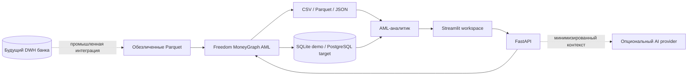
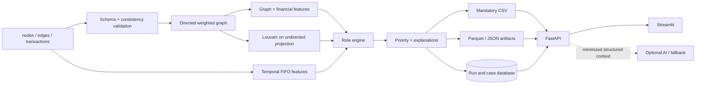

# Архитектура Freedom MoneyGraph AML

## Назначение и границы первой версии

Freedom MoneyGraph AML — локальная система поддержки AML-расследований по обезличенному графу внутрибанковских переводов. Она отвечает на практический вопрос аналитика: **каких клиентов проверить первыми и какие наблюдаемые признаки объясняют этот приоритет**.

Система не выносит юридических решений, не присваивает вероятность преступления и не заменяет банковские процедуры KYC/AML. Входная выборка содержит только наблюдаемую часть исходящих переводов от seed-клиентов; поэтому выводы являются воспроизводимыми аналитическими гипотезами.

## Контекст системы



Текущая поставка работает локально с тремя Parquet-файлами. DWH, IAM/SSO, SIEM, корпоративное хранилище секретов и промышленный PostgreSQL обозначены как внешние границы, а не имитируются.

## Контейнеры и компоненты

### Аналитический pipeline

Одна команда `python -m moneygraph.cli analyze --data ./data --out ./out` координирует последовательность:

1. загрузка `nodes.parquet`, `edges.parquet`, `transactions.parquet`;
2. строгая валидация схемы и согласованности;
3. построение направленного взвешенного графа со всеми узлами, включая изолированные;
4. графовые, финансовые и временные признаки;
5. Louvain-кластеры на ненаправленной проекции;
6. объяснимые scores ролей;
7. приоритет аналитической проверки и его драйверы;
8. resilience-сценарии;
9. атомарная выгрузка CSV/Parquet/JSON и запись метаданных запуска.

Обязательный результат не зависит от сети, GPU или AI-ключей. Фиксированный seed и стабильная сортировка обеспечивают повторяемость.

### API

FastAPI предоставляет `/health`, сводку, карточки узлов, локальные графы, upstream/downstream-трассировку, common receivers, кластеры и workflow investigations. Входные параметры валидируются Pydantic-схемами; глубина, размеры списков и число путей ограничены, чтобы циклы и ветвление графа не приводили к неограниченному обходу.

### Analyst UI

Streamlit использует API как основной источник данных. Интерфейс показывает сводку, top priority, карточку узла, локальный направленный граф, кластеры, исследование потоков, resilience и investigations. Он намеренно не рисует весь граф по умолчанию: аналитик работает с ограниченным подграфом и переходит от причины приоритета к проверяемым связям.

### Хранилище

SQLite обеспечивает zero-config demo-режим: запуски, snapshot ролей/приоритетов, cases, узлы case, заметки и audit events. Доступ изолирован за репозиториями SQLAlchemy; `DATABASE_URL` является точкой переключения на PostgreSQL. Demo-имя аналитика служит только атрибутом аудита и не является аутентификацией.

### AI boundary

AI Copilot — необязательный слой поверх рассчитанных результатов. Он не назначает роли и не влияет на `priority_score`. Провайдер получает только обезличенные `gid`, числовые метрики и ограниченный контекст выбранного действия. При выключенном AI или ошибке провайдера используется детерминированный fallback; pipeline, API health и основной UI продолжают работать.

## Поток данных



### Offline boundary

В offline-части выполняются валидация, признаки, кластеризация, роли, priority и обязательные выгрузки. Это единственный источник канонических аналитических результатов. Ошибка критической проверки завершает запуск ненулевым кодом; исходные Parquet не изменяются.

### Online boundary

API и UI читают результаты завершённого запуска и обслуживают ограниченные запросы расследования. Изменяемые пользовательские данные — cases, notes, statuses и audit events — хранятся отдельно от неизменяемых входов и аналитических артефактов.

## Развёртывание

`docker compose up --build` поднимает три сервиса:

- `analyzer` — one-shot контейнер, который должен успешно завершить pipeline;
- `api` — стартует после успешного analyzer и проходит `/health`;
- `ui` — стартует после healthy API и проверяет `/_stcore/health`.

Контейнер запускается от непривилегированного пользователя, root filesystem read-only, Linux capabilities удалены, `no-new-privileges` включён. `data/` монтируется read-only; `out/`, `artifacts/` и volume SQLite доступны для записи. Порты публикуются только на loopback хоста: API `127.0.0.1:8000`, UI `127.0.0.1:8501`.

## Нефункциональные решения

| Свойство | Решение | Проверка |
|---|---|---|
| Воспроизводимость | seed 42, стабильные sort/tie-break, конфигурационные веса | повторный pipeline и сравнение CSV |
| Объяснимость | отдельные scores ролей, числовой evidence, priority contributions | CSV, карточка узла, методология |
| Отказоустойчивость | AI вне критического пути; явные validation failures | тесты fallback и CLI exit code |
| Ограниченность запросов | depth/list/path limits | API validation tests |
| Аудит | run manifest, input hashes, config/model version, case audit events | JSON/DB export |
| Приватность | offline core, минимизированный AI-контекст, env secrets | security review |

## Банковская интеграционная граница

Перед промышленным подключением нужны отдельные проекты интеграции:

1. DWH/event ingestion и контроль качества по банковским data contracts;
2. OIDC/SSO, RBAC/ABAC и разделение полномочий;
3. TLS/mTLS, API gateway, rate limiting и сетевые политики;
4. Vault/HSM или корпоративный secrets manager;
5. SIEM, неизменяемый audit trail и политика хранения;
6. PostgreSQL HA, backup/restore и disaster recovery;
7. model/rules validation, change approval и мониторинг drift;
8. privacy/legal review для любых внешних AI-провайдеров.

До выполнения этих пунктов система является pilot-ready reference implementation, а не сертифицированной банковской платформой.

## Как открыть схему решения

Исходник отдельной слайдоподобной схемы находится в `docs/solution_flow.mmd`. Его можно открыть встроенным Mermaid Preview в IDE или экспортировать при установленном Mermaid CLI:

```bash
mmdc -i docs/solution_flow.mmd -o docs/solution_flow.svg -b transparent
```

Схема не содержит данных клиентов и не требует запуска приложения.
