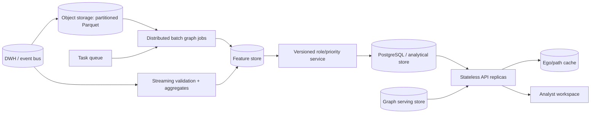

# Масштабирование до миллиона узлов

## Цель

Текущая NetworkX-реализация — проверяемая reference implementation: она фиксирует семантику направлений, формулы, ограничения seed/depth 4, стабильные tie-break и выходные контракты. При росте до порядка миллиона узлов меняется вычислительный движок, но не смысл признаков и объяснений.

## Где возникнет предел

На больших графах главными ограничениями будут:

- память Python-объектов NetworkX;
- точные betweenness/HITS и полные обходы;
- повторное чтение всего месяца при каждом запуске;
- синхронные API-трассировки по широким компонентам;
- хранение snapshots и case history в SQLite;
- визуализация слишком больших подграфов.

Переход не должен начинаться с «переписать всё». Сначала измеряются размер графа, плотность, SLA batch/online, частота обновления и доступная инфраструктура.

## Целевая архитектура

## Выбор графового движка

| Сценарий | Кандидат | Причина |
|---|---|---|
| Один мощный сервер, batch до миллионов узлов | igraph или graph-tool | компактное хранение и C/C++ algorithms при близкой Python-модели |
| Уже есть Spark/data lake | Spark GraphFrames/GraphX | distributed ETL, partitioning, совместная эксплуатация с DWH |
| Нужны интерактивные path/ego запросы | Neo4j или TigerGraph | индексированные графовые traversal и горизонтальная serving-модель |
| Нужна максимальная переносимость формул | columnar SQL + специализированные jobs | прозрачные признаки и простая валидация |

Neo4j/TigerGraph не обязаны становиться источником истины для batch-scoring. Практичный вариант — считать versioned features в lake/feature store, а в graph database публиковать только serving projection.

## Хранение и partitioning

- Хранить raw/validated/features как Parquet в object storage.
- Partition keys: дата/месяц, источник, при необходимости hash bucket `src`.
- Не партиционировать только по `gid`: это создаёт множество мелких файлов.
- Выполнять compaction и контролировать schema evolution.
- Отделить immutable raw zone, validated zone и versioned feature zone.
- Сохранять lineage: input snapshot, rule version, code version, config hash.

## Инкрементальные признаки

Ежедневный или потоковый слой обновляет аддитивные метрики:

- in/out суммы и counts;
- уникальных контрагентов через exact state либо HyperLogLog;
- active days и окна 0–2 дня;
- повторяющиеся/круглые суммы;
- новые edges и component deltas.

Глобальные признаки пересчитываются реже или приближённо:

- PageRank — warm start/incremental iterations;
- betweenness — sampled pivots с фиксированным seed;
- Louvain/Leiden — distributed либо incremental community updates;
- seed reach — bounded multi-source traversal, bitmap/graph engine;
- resilience — offline сценарии на snapshot, не online request.

## Разделение batch и online

### Batch plane

Оркестратор задач запускает validation, features, clusters, roles, priority и публикацию snapshot. Запуск идемпотентен по `(input_snapshot_hash, config_version)`. Большие этапы пишут промежуточные versioned tables; retry не создаёт двойных side effects.

### Online plane

API не пересчитывает centrality. Он читает готовый snapshot, выполняет ограниченные ego/path/common-receiver запросы и пишет cases. Тяжёлый запрос переводится в task queue и возвращает job id; UI показывает прогресс.

## Serving и кэш

- Кэшировать ego graph по `(snapshot, gid, depth, filters)` с коротким TTL.
- Не кэшировать authorization decision вместе с данными.
- Ограничить `depth`, fan-out, paths, node/edge count и response bytes.
- Для common receivers использовать reverse indexes/bitmaps достижимости либо graph queries.
- Пагинировать top nodes/clusters и использовать keyset pagination для крупных списков.
- UI всегда визуализирует bounded subgraph, не миллион вершин.

## База cases и аудит

SQLite заменяется PostgreSQL:

- отдельные schemas/roles для analytics и investigations;
- row-level/tenant policies при необходимости;
- optimistic locking для совместного редактирования case;
- append-only audit events;
- read replicas для аналитических запросов;
- partitioning snapshots по run/date;
- backup, PITR и регулярные restore drills.

## Версионирование и model governance

Каждый score должен воспроизводиться по:

- input snapshot/hash;
- версии feature definitions;
- версии конфигурации весов/порогов;
- версии community algorithm и seed;
- версии приложения;
- времени публикации и approver.

Новая версия выполняется в shadow mode, сравнивается с предыдущей по распределениям ролей, top-list stability, explainability и нагрузке. Rollback переключает active snapshot, а не пытается «отменить» частично рассчитанные строки.

## Наблюдаемость и SLO

До определения SLO нужно измерить нагрузку, но минимум метрик включает:

- freshness входа и опубликованного snapshot;
- длительность/ошибки каждого pipeline stage;
- число отклонённых строк и validation warnings;
- API latency/error rate по типу traversal;
- cache hit rate и queue depth;
- распределение role/priority и drift относительно предыдущего snapshot;
- число fallback AI и внешних ошибок без влияния на core.

Tracing связывает request ID UI/API с query/job/run ID, не записывая секреты или полный граф в spans.

## Поэтапный план

### Этап 1: до сотен тысяч узлов

1. Профилировать текущий pipeline и заменить только узкие места на векторные/igraph реализации.
2. Перенести snapshots в partitioned Parquet, cases — в PostgreSQL.
3. Добавить task queue, cache и stateless API replicas.
4. Сохранить golden synthetic tests и CSV-contract tests.

### Этап 2: около миллиона узлов

1. Выбрать Spark/graph engine по инфраструктуре и SLA.
2. Ввести инкрементальные дневные aggregates и feature store.
3. Разделить batch scoring и interactive graph serving.
4. Использовать sampled/approximate centrality с документированной погрешностью.
5. Включить distributed community detection и stable remapping IDs между snapshots.

### Этап 3: промышленная эксплуатация

1. Интегрировать DWH/event bus, IAM, SIEM, Vault и API gateway.
2. Ввести model/rules approval, shadow runs, drift alerts и rollback.
3. Провести capacity, resilience, security и disaster-recovery тесты.
4. Закрепить data retention, privacy и AI governance.

## Как доказать эквивалентность после миграции

Reference implementation остаётся oracle на малых графах. Один и тот же synthetic/golden snapshot запускается в NetworkX и новом движке; сравниваются raw aggregates, FIFO, стабильные clusters (с учётом эквивалентности membership), role components, priority contributions и top-order. Приближённые метрики имеют заранее заданный tolerance и никогда не меняют смысл evidence без отдельной версии правил.
