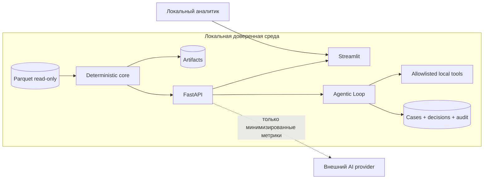

# Безопасность и приватность

## Статус документа

Это threat model pilot-ready локальной версии. Он не является заключением банковского security review и не утверждает готовность к промышленной обработке персональных или банковских данных.

## Активы

- обезличенные Parquet и их хэши;
- аналитические CSV/Parquet/JSON;
- роли, priority и объяснения;
- investigations, заметки и audit events;
- monitoring scans, alerts, action proposals, решения аналитика и результаты локальных tools;
- конфигурация правил и версии запусков;
- опциональные API-ключи AI-провайдеров.

В кейсе нет ФИО, ИИН, устройств, адресов, дохода или иных придуманных атрибутов клиента. `gid` остаётся устойчивым идентификатором и поэтому всё равно считается чувствительным аналитическим контекстом.

## Trust boundaries

Граница внешнего AI по умолчанию закрыта: `AI_ENABLED=false`. Core pipeline не имеет сетевой зависимости.

## Threat model

| Угроза | Возможный ущерб | Текущая мера | Остаточный риск / следующий шаг |
|---|---|---|---|
| Подмена входных файлов | неверные роли и приоритеты | строгая валидация, SHA-256 в manifest, read-only mount | подпись/каталог данных и lineage из DWH |
| Path traversal или запись во вход | изменение данных/файлов | в Compose вход смонтирован `data:ro`, выходы отделены; API не принимает файловые пути | CLI в локальном режиме доверяет оператору; нужны allowlist путей и service account |
| Неограниченный обход графа | DoS API | Pydantic validation, предел depth/list/path, bounded ego | gateway quotas и load testing |
| SQL injection | чтение/изменение cases | SQLAlchemy и параметризованные операции | SAST/DAST и PostgreSQL least privilege |
| Утечка ключа | доступ к внешнему provider | только env, `.env` игнорируется, ключи не логируются и не входят в image | Vault/HSM, rotation, egress policy |
| Отправка датасета в LLM | утечка графа | AI вне core; только выбранные обезличенные метрики | DLP, approved on-prem provider, legal/privacy review |
| Prompt injection | неверное AI-описание/действие | tool results — единственный источник фактов; fallback; AI не влияет на scores | tool allowlist, output validation, human confirmation |
| Автономное ограничительное действие | необоснованная блокировка клиента/перевода | tools `block`, `freeze`, `send` отсутствуют; approve/reject принадлежит аналитику | production maker-checker и отдельные интеграционные полномочия |
| Подмена action или аргументов клиентом | запуск неразрешённого инструмента | server-owned action keys и сохранённые server-owned arguments | policy enforcement и authorization на gateway/service layer |
| Повтор approve-запроса | дублирование draft/watchlist/case | обязательный `Idempotency-Key`, повтор возвращает сохранённый результат | shared idempotency store и транзакционная блокировка в multi-instance deployment |
| Ложное ощущение realtime | ошибочная оценка скорости обнаружения | UI/API маркируют calendar-day replay и дневную гранулярность | event-time contracts и latency SLO после подключения потока |
| Несанкционированная внешняя отправка draft | регуляторная или информационная утечка | draft имеет только локальный статус и не отправляется | approved submission adapter с dual control — отдельный проект |
| Неавторизованный доступ | раскрытие графа/cases | порты Compose только loopback | обязательные OIDC/SSO, RBAC/ABAC, TLS/mTLS |
| Подмена audit log | потеря трассируемости | structured audit events в БД | append-only/WORM storage и SIEM |
| Supply-chain dependency | выполнение уязвимого кода | ограниченные version ranges, CI install/build | lockfile/hash pinning, SBOM, dependency scan |
| CSV formula injection | выполнение формулы при открытии экспорта | значения домена формируются системой и не должны начинаться с формул | явное escaping пользовательских notes в CSV и тесты |

## Реализованные меры

### Данные и файловая система

- Входные Parquet не модифицируются.
- Критические ошибки validation завершают pipeline ненулевым кодом.
- Docker монтирует `data/` read-only, а выходы и БД — отдельными writable volumes.
- Контейнер использует непривилегированного пользователя, read-only root filesystem, `cap_drop: ALL` и `no-new-privileges`.
- Артефакты и manifest связываются с hash входов и версией правил.

### API и вычисления

- Входы описаны Pydantic-схемами; неизвестные `gid` и неверные диапазоны получают явные HTTP-коды.
- Глубина обхода и размеры запросов ограничены.
- CORS задаётся через `CORS_ORIGINS`, а не открыт безусловно.
- `/health` не зависит от AI и не раскрывает секреты.
- Детали исключений предназначены для server logs; клиент получает контролируемую ошибку и request ID.

### Секреты и AI

- `OPENAI_API_KEY` и `NVIDIA_API_KEY` читаются только из environment variables.
- `.env.example` содержит пустые значения, реальный `.env` исключён из Git.
- AI выключен по умолчанию и не участвует в role/priority pipeline.
- Внешнему provider передаётся минимальный структурированный контекст, не полный raw dataset.
- Ошибка или отсутствие ключа приводит к deterministic fallback, а не к падению приложения.

### Аудит

- Pipeline run хранит конфигурацию/версию и input hashes.
- Действия с investigation сохраняют аналитика demo-session и audit event.
- Agentic Loop добавляет события для scan, alert, proposals, approve/reject и результата исполнения.
- Отклонённое действие не запускает tool; подтверждённое действие требует точной строки `APPROVE` и idempotency key.
- `ANALYST_NAME` — атрибут демо-аудита, **не механизм аутентификации**.

### Human-in-the-Loop и безопасные инструменты

- AI не принимает финальное AML-решение и не имеет прямого доступа к банковским операциям.
- Сервер разрешает только локальный draft, bounded money route и local watchlist.
- UI не показывает block/freeze/send как доступные действия; неизвестный action key не исполняется.
- `recommendation_score` не является вероятностью правонарушения.
- Дневной replay явно обозначен как simulation; на date-only данных не вычисляется `dwell < 2h`.
- Локальный AML draft не отправляется в АФМ/ПОД/ФТ и должен пройти внутреннюю проверку человека.

Текущая БД использует application-level append-only запись событий, но SQLite-файл доступен локальному оператору и не является криптографически защищённым WORM-журналом.

## Явно не реализовано в pilot

- IAM/SSO, MFA, RBAC/ABAC и segregation of duties;
- TLS/mTLS, WAF/API gateway и rate limiting;
- неизменяемый централизованный audit log и SIEM;
- Vault/HSM, автоматическая rotation и egress allowlist;
- PostgreSQL HA, шифрование backups и disaster recovery;
- data retention/deletion policy и классификация данных;
- SBOM, подписанные images, container/dependency/SAST/DAST scanning;
- formal model validation, fairness review и change approval;
- корпоративный maker-checker для approve и отдельный шлюз для любых внешних действий;
- промышленная защита Streamlit как internet-facing приложения.

Локальный demo нельзя публиковать в недоверенную сеть без этих компенсирующих мер.

## Минимальный production checklist Freedom Bank

1. Разместить сервисы в закрытом сегменте; разрешить egress только утверждённым адресам.
2. Интегрировать OIDC/SSO и enforce роли viewer/analyst/supervisor/admin.
3. Поставить API за gateway с TLS/mTLS, rate limits, WAF и request size limits.
4. Перенести секреты в корпоративный manager, включить rotation и короткоживущие credentials.
5. Перенести БД в PostgreSQL с отдельными ролями, encryption at rest, backup/restore drills.
6. Отправлять security/audit events в SIEM; защищать их от изменения.
7. Добавить SBOM, image signing, dependency/SAST/DAST/container scans в release gate.
8. Провести privacy/legal review AI; для чувствительных данных использовать approved private endpoint либо полностью offline fallback.
9. Зафиксировать правила model governance: версия конфигурации, dual control, validation set, drift monitoring и rollback.
10. Ввести maker-checker: предложение, подтверждение и внешнее действие выполняются разными полномочиями; запретить LLM прямой вызов банковских адаптеров.
11. Перенести audit в append-only/WORM-хранилище, связать события correlation ID и настроить контроль пропусков цепочки.
12. Провести threat modeling и penetration test в целевой инфраструктуре.

## Реакция на секрет в репозитории

Если ключ обнаружен в коде, истории Git или логе, его нужно считать скомпрометированным: немедленно отозвать и перевыпустить у провайдера, удалить из текущей версии и истории по согласованной процедуре, проверить логи использования и добавить регрессионный secret scan. Простого удаления строки из последнего commit недостаточно.
