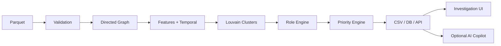

# Master prompt для Codex: Freedom MoneyGraph AML

Скопируй весь текст ниже в Codex, открыв корень репозитория, где доступны материалы кейса (`starter (1).zip` или папка `starter/`, `data (1).zip` или папка `data/`, исходный `README.md`, ТЗ кейса и инструкции HackAlem AI).

---

## Роль и ожидаемый результат

Ты — ведущий инженер, архитектор данных, специалист по графовой аналитике и ML/AI-интеграциям. Твоя задача — **не создать демонстрационный scaffold и не ограничиться прототипом**, а собрать и фактически проверить первую полностью рабочую, воспроизводимую, локально запускаемую версию продукта **Freedom MoneyGraph AML** для AML-аналитиков Freedom Bank.

Это должна быть pilot-ready / production-shaped первая версия: с рабочим аналитическим ядром, API, интерфейсом расследования, воспроизводимым пайплайном, хранением результатов, аудитом запусков, тестами, Docker-запуском, документацией и необязательным AI Copilot. Не утверждай, что продукт прошёл банковскую сертификацию или готов к промышленному подключению к внутренним системам банка: интеграции с DWH, IAM/SSO, SIEM, секрет-хранилищем и процессы model validation должны быть честно перечислены как следующий этап.

Главная бизнес-задача системы:

> По обезличенному направленному графу внутрибанковских переводов на четыре колена восстановить наблюдаемую финансовую структуру сети, присвоить каждому узлу объяснимую функциональную роль, выделить сообщества и ключевые узлы, ранжировать клиентов по приоритету дальнейшей AML-проверки и дать аналитику удобные инструменты для исследования потоков.

Система должна отвечать на вопрос:

> «Кого из 2 248 клиентов смотреть первым и почему?»

Не задавай уточняющих вопросов, если ответ можно получить из файлов репозитория. Сначала изучи все материалы, затем прими разумные инженерные решения и зафиксируй их в документации. Приоритет — **законченный работающий продукт**, а не максимальное количество технологий.

---

# 1. Сначала изучи материалы и существующий код

1. Найди и прочитай:
   - ТЗ кейса «Граф денег»;
   - корневой `README.md` с описанием датасета;
   - `starter/README.md`;
   - `starter/starter.py`;
   - `starter/requirements.txt`;
   - инструкции участникам и правила HackAlem AI.
2. Если материалы находятся в ZIP, распакуй их в рабочие папки, не удаляя исходные архивы.
3. Используй `starter.py` как проверенную отправную точку: там уже реализованы загрузка Parquet, sanity checks, построение `nx.DiGraph`, базовые метрики и каркасы выгрузок.
4. Не хардкодь ни один `gid`, ни готовые роли, ни готовый топ-лист.
5. Не выдумывай признаки клиентов, которых нет в данных: ФИО, ИИН, возраст, доход, организация, устройство, адрес и т. п.
6. Не используй внешнее обогащение данных. Основное решение должно работать полностью локально и без интернета.

После изучения материалов создай краткий `docs/implementation_plan.md`, где перечисли:
- найденную структуру исходных файлов;
- выбранный стек и причину выбора;
- этапы реализации;
- ключевые риски данных;
- критерии готовности.

Затем сразу переходи к реализации, не останавливайся после плана.

---

# 2. Факты о входных данных, которые нельзя нарушать

Работай с тремя файлами:

- `data/nodes.parquet`: 2 248 узлов;
- `data/edges.parquet`: 3 119 агрегированных направленных рёбер;
- `data/transactions.parquet`: 4 840 отдельных транзакций.

Период: `2026-07-01` — `2026-07-31`.

Исходных seed-клиентов: 81.

Глубина обхода: 4 колена.

В выборку входят только исходящие внутрибанковские переводы и только операции от 5 000 KZT.

Распределение узлов по глубине:
- depth 0 / seed: 81;
- depth 1: 472;
- depth 2: 462;
- depth 3: 789;
- depth 4: 444.

Обязательно учти ограничения:

1. **Граница depth=4.** Узел `depth == 4` и `out_degree == 0` нельзя автоматически считать `terminal`: исходящие связи могли не попасть в выгрузку из-за окончания обхода.
2. **Неполный входящий поток seed.** Граф строился от seed наружу; входящие переводы seed извне выборки не видны. Не делай вывод о транзитности seed только по `out_kzt / in_kzt`.
3. **Только исходящие связи из наблюдаемой выборки.** Полный баланс узла неизвестен.
4. **Порог 5 000 KZT.** Дробление ниже порога невидимо.
5. 19 seed могут отсутствовать в рёбрах, ещё 12 могут встречаться только как получатели; все узлы всё равно должны попасть в итог.
6. Граф состоит из нескольких слабосвязных компонент; не предполагай, что сеть монолитна.
7. Ground truth ролей отсутствует. Результат оценивается по обоснованности, объяснимости и воспроизводимости, а не по accuracy относительно скрытых меток.
8. Любые выводы формулируй как **аналитические признаки и гипотезы для проверки**, а не как утверждение о преступлении или виновности.

---

# 3. Выбор стека

Сам выбери окончательный стек, но если нет сильной причины отклоняться, используй следующий надёжный и быстро воспроизводимый вариант:

- Python 3.11+;
- `pandas`, `numpy`, `pyarrow`;
- `networkx` для первой версии графовых алгоритмов;
- `scikit-learn` только для объяснимой дополнительной аномалистики, не как black box для назначения ролей;
- FastAPI + Pydantic для API;
- Streamlit для рабочего интерфейса аналитика;
- Plotly для интерактивных графиков и визуализации локального подграфа;
- SQLAlchemy + SQLite по умолчанию для zero-config хранения запусков, кейсов, заметок и audit log;
- опциональный PostgreSQL через Docker Compose profile или переменную `DATABASE_URL`;
- `pytest`, `ruff` и при возможности `mypy`;
- Docker / Docker Compose;
- OpenAI SDK и/или OpenAI-compatible NVIDIA NIM клиент только как **опциональный AI-слой**.

Не выбирай тяжёлый фронтенд-фреймворк только ради внешнего вида, если это угрожает завершённости. Полностью работающий Streamlit + FastAPI предпочтительнее недоделанного React.

---

# 4. Целевая структура репозитория

Разрешается адаптировать структуру, но итог должен быть не менее организованным:

```text
.
├── data/                         # входные parquet, не изменять
├── out/                          # обязательные CSV и отчёты
├── artifacts/                    # дополнительные parquet/json/html
├── src/
│   └── moneygraph/
│       ├── __init__.py
│       ├── config.py
│       ├── logging_config.py
│       ├── cli.py
│       ├── domain/
│       │   ├── roles.py
│       │   └── schemas.py
│       ├── pipeline/
│       │   ├── ingestion.py
│       │   ├── validation.py
│       │   ├── graph_builder.py
│       │   ├── features.py
│       │   ├── temporal.py
│       │   ├── clustering.py
│       │   ├── role_engine.py
│       │   ├── priority.py
│       │   ├── explanations.py
│       │   ├── resilience.py
│       │   ├── exporters.py
│       │   └── service.py
│       ├── repository/
│       │   ├── database.py
│       │   ├── models.py
│       │   └── repositories.py
│       ├── api/
│       │   ├── main.py
│       │   ├── dependencies.py
│       │   └── routes/
│       │       ├── health.py
│       │       ├── runs.py
│       │       ├── nodes.py
│       │       ├── clusters.py
│       │       ├── investigations.py
│       │       └── assistant.py
│       ├── ai/
│       │   ├── base.py
│       │   ├── tools.py
│       │   ├── deterministic_fallback.py
│       │   ├── openai_provider.py
│       │   └── nvidia_provider.py
│       └── ui/
│           └── app.py
├── config/
│   └── default.yaml
├── tests/
│   ├── fixtures/
│   ├── test_validation.py
│   ├── test_features.py
│   ├── test_temporal.py
│   ├── test_roles.py
│   ├── test_depth4.py
│   ├── test_seed_handling.py
│   ├── test_clustering.py
│   ├── test_priority.py
│   ├── test_exports.py
│   ├── test_api.py
│   └── test_e2e.py
├── docs/
│   ├── implementation_plan.md
│   ├── architecture.md
│   ├── methodology.md
│   ├── demo_script.md
│   ├── security.md
│   └── scaling.md
├── scripts/
│   ├── run_pipeline.sh
│   ├── verify_outputs.py
│   └── smoke_test.sh
├── README.md
├── pyproject.toml
├── requirements.txt             # можно генерировать из pyproject
├── Makefile
├── Dockerfile
├── docker-compose.yml
├── .env.example
├── .gitignore
└── .github/workflows/ci.yml
```

Если для надёжности разумнее сделать меньше файлов — можно, но разделение аналитического ядра, API, UI, AI и хранения должно оставаться ясным.

---

# 5. Обязательный воспроизводимый pipeline

Реализуй одну основную команду:

```bash
python -m moneygraph.cli analyze --data ./data --out ./out
```

Дополнительно предоставь:

```bash
make analyze
```

Команда должна без ручных шагов:

1. загрузить три Parquet;
2. проверить схему, типы, дубликаты, суммы, даты и согласованность `edges` с `transactions`;
3. построить направленный взвешенный граф;
4. добавить все 2 248 узлов, включая изолированные;
5. посчитать графовые, финансовые и временные признаки;
6. выполнить кластеризацию;
7. рассчитать score каждой роли;
8. назначить основную роль и `role_score`;
9. рассчитать `priority_score`;
10. сформировать объяснения;
11. сформировать кластеры и гипотезы;
12. записать обязательные CSV;
13. сохранить расширенные артефакты и validation report;
14. записать запуск в БД и audit log;
15. завершиться с ненулевым кодом при критической ошибке.

На предоставленном объёме полный запуск должен занимать **не более 5 минут на обычном ноутбуке**. В конце печатай длительность каждого этапа и общую длительность.

Используй детерминированность:
- `random_seed = 42`;
- стабильная сортировка;
- стабильная нумерация кластеров;
- одинаковый ввод должен давать одинаковые CSV.

---

# 6. Проверка входных данных

Реализуй строгие проверки:

- наличие файлов;
- обязательные колонки и ожидаемые типы;
- отсутствие отрицательных и нулевых сумм там, где это недопустимо;
- корректный диапазон дат;
- `src != dst` — если self-loop обнаружен, не удаляй молча: зафиксируй и обработай;
- уникальность `gid` в `nodes`;
- уникальность пары `src,dst` в `edges`;
- совпадение агрегации `transactions` с `edges` по сумме и количеству с разумной числовой погрешностью;
- наличие всех `src/dst` в `nodes`;
- количество seed;
- количество узлов, рёбер, транзакций;
- список изолированных узлов;
- количество weakly connected components;
- предупреждения о несоответствиях без скрытого исправления данных.

Создай `out/validation_report.json` и отображай результаты в UI.

---

# 7. Графовые и финансовые признаки

Минимально вычисли для каждого узла:

- `gid`, `depth`, `is_seed`;
- `in_deg`, `out_deg`;
- `in_kzt`, `out_kzt`;
- `in_tx`, `out_tx`;
- `total_kzt`, `total_tx`;
- `pagerank` с `sum_kzt` как весом;
- HITS `authority` и `hub` с безопасным fallback при проблеме сходимости;
- betweenness centrality; разрешается детерминированная аппроксимация с фиксированным seed для гарантии времени;
- weak component id и размер;
- `pass_through = out_kzt / in_kzt`, но с отдельным `pass_through_valid`, который ложен для seed и узлов без наблюдаемого входа;
- `truncated_by_depth = depth == 4 and out_deg == 0`;
- число прямых seed-предшественников;
- число seed, которые достигают узла по направленным путям до 4 колен;
- минимальное и среднее расстояние от достижимых seed;
- долю входящих/исходящих контрагентов;
- статистики сумм операций;
- долю повторяющихся сумм и долю круглых сумм как дополнительные объяснимые сигналы;
- percentile-rank признаков, вычисленный устойчиво через `log1p` для денежных величин.

Для алгоритмов, где сумма должна интерпретироваться как «сила связи», используй `sum_kzt`. Для shortest-path/betweenness, где вес означает стоимость, создай отдельный атрибут расстояния, например:

```python
distance = 1.0 / log1p(sum_kzt)
```

Не передавай `sum_kzt` как distance без преобразования.

Сохрани расширенные признаки в:

```text
artifacts/node_features.parquet
```

Не загрязняй обязательный CSV десятками дополнительных колонок.

---

# 8. Временной анализ

`transactions.parquet` должен реально использоваться.

Для каждого узла рассчитай:

- first/last incoming date;
- first/last outgoing date;
- число активных входящих и исходящих дней;
- максимальное число уникальных плательщиков за один день;
- максимальное число получателей за один день;
- дневные всплески относительно собственной активности;
- долю входящего объёма, после которого наблюдается исходящий поток в течение 0–2 дней;
- медианное/взвешенное время удержания средств в днях;
- `matched_out_ratio`.

Для времени удержания реализуй объяснимый FIFO-matching наблюдаемых входящих и исходящих транзакций узла:

1. сортируй операции по дате;
2. исходящую сумму сопоставляй с ранее наблюдаемыми входящими остатками;
3. фиксируй объём и число дней удержания;
4. не используй будущий вход для объяснения прошлого выхода;
5. для seed снижай доверие к метрике и не делай сильный вывод из-за неполных входящих данных;
6. обозначай результат как оценку по наблюдаемой части графа.

Временные метрики должны усиливать `transit_score`, но не быть единственным критерием.

---

# 9. Кластеризация

Используй Louvain community detection на **ненаправленной проекции**, где вес ребра — сумма переводов. Направленный оригинал сохраняй для всех потоковых метрик и визуализации.

Требования:

- добавь все узлы, включая изолированные;
- используй фиксированный seed;
- сделай стабильные `cluster_id`: сортируй сообщества по убыванию размера, затем по минимальному `gid`;
- не объединяй несвязанные изолированные вершины искусственно в одну «группу»;
- вычисли внутренний оборот кластера только по рёбрам, у которых обе вершины принадлежат кластеру;
- вычисли внешние входящие и исходящие связи кластера;
- вычисли число seed;
- после расчёта priority заполни `top_gids`;
- сформируй детерминированную гипотезу о назначении кластера на основе ролей и наблюдаемых признаков.

Примеры осторожных гипотез:

- «Несколько seed сходятся к общей точке с признаками консолидации и последующего распределения»;
- «Преобладают короткие транзитные цепочки с быстрым перенаправлением наблюдаемого объёма»;
- «Небольшой периферийный компонент без выраженного ключевого узла»;
- «Изолированный узел; данных недостаточно для структурной гипотезы».

Не используй LLM для обязательного поля `hypothesis`; оно должно формироваться офлайн и воспроизводимо. AI может дать дополнительное расширенное описание в интерфейсе.

---

# 10. Объяснимый Role Engine

Обязательный словарь ролей:

- `consolidator` — собирает средства от нескольких участников;
- `transit` — пропускает наблюдаемые средства дальше, не удерживая их надолго;
- `distributor` — распределяет средства множеству получателей;
- `terminal` — вероятный конечный получатель в пределах наблюдаемой сети;
- `coordinator` — структурно важный узел, связывающий потоки/группы;
- `peripheral` — выраженные признаки специальных ролей не выявлены.

Не назначай роль одним жёстким `if`. Рассчитай отдельный score 0–1 для каждой роли. Все веса вынеси в `config/default.yaml`, чтобы метод был аудируемым.

Используй percentile-rank и интерпретируемые компоненты. Реализуй как минимум такую базовую логику; веса можно слегка откалибровать по реальному распределению, но изменения документируй.

## 10.1 Consolidator score

Пример состава:

```text
0.35 * percentile(in_deg)
0.15 * percentile(in_tx)
0.15 * percentile(log1p(in_kzt))
0.10 * authority_percentile
0.10 * seed_reach_percentile
0.10 * retention_signal
0.05 * same_day_multi_payer_signal
```

`retention_signal` используй только при достоверном наблюдаемом входе. Для seed не опирайся на него как на главный признак.

## 10.2 Distributor score

```text
0.40 * percentile(out_deg)
0.20 * percentile(out_tx)
0.15 * percentile(log1p(out_kzt))
0.10 * hub_percentile
0.10 * recipients_to_payers_signal
0.05 * daily_fan_out_signal
```

## 10.3 Transit score

```text
0.25 * pass_through_similarity_to_1
0.25 * fast_forward_0_2d_ratio
0.15 * matched_out_ratio
0.10 * in_out_degree_balance
0.10 * in_out_amount_balance
0.10 * betweenness_percentile
0.05 * temporal_activity_signal
```

Для seed score должен быть ограничен/понижен из-за неполных входящих данных, если нет иных сильных подтверждений.

## 10.4 Coordinator score

```text
0.30 * betweenness_percentile
0.20 * pagerank_percentile
0.20 * seed_reach_percentile
0.15 * cross_cluster_bridge_signal
0.10 * component_structural_signal
0.05 * balanced_flow_signal
```

`cross_cluster_bridge_signal` рассчитывай после предварительной кластеризации.

## 10.5 Terminal score

Сильный сигнал допустим только если:
- есть наблюдаемый вход;
- исходящий поток отсутствует или очень мал;
- `depth < 4` либо есть иные основания, исключающие простую границу обхода.

Для `truncated_by_depth == True` обязательно ограничь `terminal_score`, например максимумом 0.25, и явно укажи в evidence, что статус конечного получателя не подтверждён из-за границы выборки.

## 10.6 Peripheral score

Формируй из отсутствия сильных специальных ролей и низкой структурной активности. Изолированные узлы также должны получить `peripheral`, но evidence должно отражать недостаток наблюдаемых связей, а не «низкий риск».

## 10.7 Выбор основной роли

- если узел полностью изолирован — `peripheral`;
- вычисли все role scores;
- выбери максимальный core score;
- если максимум ниже настраиваемого порога (например 0.40), назначь `peripheral`;
- применяй только документированные overrides для depth=4 и seed;
- `role_score` должен учитывать величину максимального score и отрыв от второго места, например:

```text
role_score = clip(0.80 * top_score + 0.20 * (top_score - second_score), 0, 1)
```

Сохрани все role scores в `artifacts/node_features.parquet`, а в обязательный CSV выведи только основную роль и confidence.

---

# 11. Priority Score

`priority_score` — это **приоритет аналитической проверки**, а не вероятность преступления.

Сделай формулу объяснимой и конфигурируемой. Базовый вариант:

```text
0.22 * coordinator_score
0.18 * consolidator_score
0.12 * distributor_score
0.08 * transit_score
0.12 * pagerank_percentile
0.12 * betweenness_percentile
0.10 * seed_reach_percentile
0.06 * turnover_percentile
```

Разрешается добавить до 0.05 объяснимой depth-relative anomaly, но не превращай итог в black box.

После raw score используй устойчивое масштабирование или percentile rank в диапазон 0–1. Сохрани вклад каждого драйвера, чтобы UI мог показать:

```text
+0.21 структурное посредничество
+0.18 связь с несколькими seed
+0.16 признаки консолидации
...
```

Не скрывай ограничения данных. Узел на depth=4 может иметь высокий priority по структурным причинам, но не должен получать ложное объяснение «деньги осели».

---

# 12. Evidence и explainability

Для каждой из 2 248 строк `nodes_roles.csv` поле `evidence` обязательно:

- непустое;
- на русском языке;
- до 200 символов;
- содержит конкретные числа;
- отражает наблюдаемые факты;
- осторожно формулирует гипотезу;
- упоминает ограничение depth=4 или seed, когда оно влияет на вывод.

Хорошие примеры:

```text
Признаки консолидации: 14 плательщиков, входящий объём 8.4 млн KZT, далее ушло 11% наблюдаемого объёма.
```

```text
Признаки распределения: 63 получателя, 79 исходящих операций, исходящий объём 12.1 млн KZT.
```

```text
Признаки транзита: сопоставлено 91% исходящего объёма, 76% перенаправлено за 0–2 дня, медиана удержания 1 день.
```

```text
Граница выборки: depth=4 и исходящие не наблюдаются; роль terminal не подтверждается, специальных признаков недостаточно.
```

Для `top_nodes.csv.why` сформируй более полное объяснение приоритета, но без обвинительных формулировок.

Разделяй в UI:

1. **Наблюдаемые факты**;
2. **Аналитическая гипотеза**;
3. **Причины приоритета**;
4. **Ограничения данных**;
5. **Рекомендуемый следующий шаг проверки**.

Последний пункт — рекомендация по данным/анализу, например «проверить внешние входящие операции» или «расширить обход следующего колена», а не юридический вывод.

---

# 13. Обязательные выходные файлы

## 13.1 `out/nodes_roles.csv`

Ровно 2 248 строк и обязательные колонки:

```text
gid
role
role_score
cluster_id
priority_score
evidence
```

Требования:
- все `gid` из `nodes.parquet`;
- роль только из обязательного словаря;
- `role_score` и `priority_score` в диапазоне [0,1];
- `cluster_id` заполнен;
- evidence непустой и <=200 символов;
- без дубликатов `gid`.

## 13.2 `out/clusters.csv`

Колонки:

```text
cluster_id
n_nodes
n_seed
sum_kzt_internal
top_gids
hypothesis
```

Одна строка на кластер.

## 13.3 `out/top_nodes.csv`

Колонки:

```text
rank
gid
role
priority_score
why
```

Не менее 20 строк; сделай по умолчанию top 50. Файл должен быть отсортирован по убыванию priority, rank начинается с 1.

## 13.4 Дополнительные артефакты

Создай:

- `artifacts/node_features.parquet`;
- `artifacts/edges_enriched.parquet`;
- `out/validation_report.json`;
- `out/run_manifest.json` с версиями, временем, конфигом, хэшами входных файлов и длительностью;
- `out/resilience.csv`;
- при возможности `out/summary.json`.

Обязательные CSV не должны зависеть от доступности AI API.

---

# 14. Network resilience

Реализуй дополнительный анализ устойчивости:

- baseline: размер крупнейшей weakly connected component и число компонент;
- последовательно удаляй top-N узлов по priority для N = 1, 3, 5, 10, 20;
- пересчитывай размер крупнейшей компоненты и число фрагментов;
- сравни с удалением такого же числа детерминированно выбранных низкоприоритетных узлов или случайным baseline с фиксированным seed;
- сохрани результат в `out/resilience.csv`;
- визуализируй в UI;
- формулируй как структурный сценарий, а не как прогноз реального поведения сети.

---

# 15. Поиск общих точек и трассировка потоков

Реализуй рабочие функции продукта:

## 15.1 Ego network

Для любого `gid` возвращай локальный подграф на 1–2 колена с направлением, суммой, количеством переводов, ролями и кластерами.

## 15.2 Downstream / upstream trace

- поиск направленных путей до 4 колен;
- ограничение числа отображаемых путей;
- ранжирование путей по наблюдаемому объёму, краткости и наличию приоритетных узлов;
- защита от взрыва числа путей.

## 15.3 Common receivers / collectors

Пользователь передаёт список `gid`. Для каждого кандидата downstream рассчитай:

- сколько выбранных узлов его достигают;
- coverage ratio;
- минимальное и среднее расстояние;
- примеры путей;
- наблюдаемый объём по связанным рёбрам;
- роль и priority кандидата.

Ранжирование кандидатов должно быть детерминированным и объяснимым, например:

```text
0.50 * coverage_ratio
0.20 * distance_score
0.20 * candidate_priority
0.10 * observed_flow_score
```

Эта функция должна работать без LLM.

---

# 16. Рабочий API

Создай FastAPI сервис с OpenAPI документацией.

Минимальные endpoints:

```text
GET  /health
GET  /api/v1/summary
POST /api/v1/runs
GET  /api/v1/runs
GET  /api/v1/runs/{run_id}
GET  /api/v1/top-nodes
GET  /api/v1/nodes/{gid}
GET  /api/v1/nodes/{gid}/ego?depth=1
GET  /api/v1/nodes/{gid}/upstream
GET  /api/v1/nodes/{gid}/downstream
POST /api/v1/common-receivers
GET  /api/v1/clusters
GET  /api/v1/clusters/{cluster_id}
POST /api/v1/investigations
GET  /api/v1/investigations
GET  /api/v1/investigations/{id}
POST /api/v1/investigations/{id}/nodes
POST /api/v1/investigations/{id}/notes
PATCH /api/v1/investigations/{id}/status
GET  /api/v1/investigations/{id}/export
POST /api/v1/assistant/query
```

Требования:
- Pydantic schemas;
- понятные HTTP-коды;
- обработка неизвестного `gid`;
- pagination для списков;
- CORS ограничиваемый через env;
- request ID и structured logging;
- `/health` не зависит от AI;
- API не должен падать, если нет ключей OpenAI/NVIDIA.

---

# 17. Investigation Workspace и хранение

Для первой рабочей версии реализуй минимальный workflow AML-аналитика:

- создание investigation/case;
- название, описание, статус (`new`, `in_review`, `escalated`, `closed`);
- добавление узлов;
- заметки аналитика;
- сохранение run/model version;
- экспорт кейса в JSON и CSV;
- audit log действий.

SQLite должен работать по умолчанию без настройки. Схема должна быть совместима с PostgreSQL через SQLAlchemy.

Храни как минимум:

- pipeline runs;
- конфигурацию/версию правил;
- hash входных данных;
- node role/priority snapshot;
- investigations;
- investigation nodes;
- notes;
- audit events.

Не реализуй фиктивную «банковскую авторизацию». Вместо этого:
- добавь простой `ANALYST_NAME`/session для аудита в demo mode;
- создай чистую abstraction point для будущего OIDC/SSO;
- подробно опиши в `docs/security.md`, что для промышленного внедрения нужны IAM, RBAC, secrets manager, TLS, SIEM и security review.

---

# 18. Интерфейс аналитика

Создай Streamlit-приложение, которое реально работает с API или напрямую с сервисным слоем при локальном режиме.

Минимальные страницы/разделы:

## 18.1 Dashboard

Покажи:
- число узлов, рёбер, транзакций, seed;
- период;
- число компонент и кластеров;
- распределение ролей;
- top priority nodes;
- предупреждения качества данных;
- длительность последнего запуска.

## 18.2 Network Explorer

- поиск по `gid`;
- визуализация направленного ego graph 1–2 hops;
- стрелки направления;
- tooltip с суммой и числом операций;
- цвет/форма по роли, легенда;
- фильтры по роли, cluster, depth, priority;
- не рисуй все 2 248 узлов одновременно по умолчанию;
- карточка выбранного узла;
- кнопки upstream/downstream/common receiver/add to case/ask AI.

## 18.3 Top Nodes

- таблица top 50;
- фильтры по роли и кластеру;
- вклад драйверов score;
- переход к графу и case.

## 18.4 Clusters

- список кластеров;
- размер, seed, внутренний оборот, top gids, гипотеза;
- локальный граф выбранного кластера с ограничением размера.

## 18.5 Flow Investigation

- ввод одного или нескольких gid;
- трассировка путей;
- поиск common receivers;
- сравнение узлов;
- понятные таблицы и path examples.

## 18.6 Investigations

- создание кейса;
- добавление/удаление узлов;
- заметки;
- статус;
- экспорт.

## 18.7 AI Copilot

- доступен только при включённом AI;
- показывает, какие инструменты были вызваны;
- ответы ссылаются на конкретные gid и метрики;
- если AI выключен, отображается deterministic fallback и понятное уведомление.

Интерфейс должен быть аккуратным, но функциональность важнее декоративного дизайна.

---

# 19. AI Copilot: целесообразное использование OpenAI/NVIDIA

AI не назначает обязательные роли и не считает priority. Ядро полностью детерминировано и работает офлайн.

Создай provider abstraction:

```text
AIProvider
├── OpenAIProvider
├── NvidiaNimProvider
└── DeterministicFallbackProvider
```

Настройки только через env:

```env
AI_ENABLED=false
AI_PROVIDER=openai
OPENAI_API_KEY=
OPENAI_MODEL=
NVIDIA_API_KEY=
NVIDIA_BASE_URL=
NVIDIA_MODEL=
```

Не указывай API-ключи в коде, тестах, логах, Docker image или README. `.env` должен быть в `.gitignore`, а `.env.example` — без секретов.

AI получает только необходимый обезличенный контекст и структурированные метрики, а не весь датасет.

Реализуй tools/functions:

- `get_node_profile(gid)`;
- `get_neighbors(gid, depth)`;
- `trace_flow(gid, direction, depth)`;
- `find_common_receivers(gids, max_depth)`;
- `compare_nodes(gids)`;
- `get_cluster(cluster_id)`;
- `get_top_nodes(filters)`;
- `explain_score(gid)`;
- `get_data_limitations()`;
- `create_investigation(title, gids)` — только после явного действия пользователя в UI.

Поддержи запросы:

- «Почему этот узел в топе?»
- «Кто собирает деньги от этих пяти gid?»
- «Сравни три узла»;
- «Покажи ключевые мосты кластера»;
- «Каких данных не хватает для проверки гипотезы?»

Правила ответа AI:

1. Использовать только результаты tools и методологию проекта.
2. Никогда не придумывать операции, суммы, связи или атрибуты.
3. Чётко разделять факт, гипотезу и ограничение.
4. Не утверждать виновность.
5. При недостатке данных писать об этом.
6. Ссылаться на gid и числовые признаки.
7. При ошибке API возвращать deterministic fallback без падения приложения.
8. Core pipeline и demo обязаны работать без AI-ключей.

Если текущая версия SDK/API отличается от ожидаемой, используй установленную официальную библиотеку и изолируй детали в provider-файле. Не хардкодь конкретную модель: модель задаётся env.

---

# 20. Безопасность и приватность

Минимум для первой версии:

- секреты только через environment variables;
- `.env` в `.gitignore`;
- никакого вывода ключей в лог;
- валидация всех входов API;
- ограничение размера списков gid и глубины обхода;
- безопасная работа с путями файлов;
- read-only отношение к исходным parquet;
- structured audit log;
- dependency pinning/разумные ranges;
- контейнер запускается не от root, если это возможно;
- запрет на отправку полного raw dataset во внешний LLM;
- sanitization контекста;
- осторожные формулировки в UI и отчётах.

Создай `docs/security.md` с:
- текущими мерами;
- threat model первой версии;
- ограничениями;
- требованиями к промышленному внедрению во Freedom Bank.

---

# 21. Тесты

Не оставляй проект без тестов. Минимально:

## Unit tests

- загрузка и validation;
- basic features;
- temporal FIFO matching;
- role scores;
- priority score;
- deterministic clustering;
- evidence <=200 и содержит числа;
- score ranges;
- изолированные узлы;
- seed pass-through handling;
- depth=4 zero-outgoing **не становится автоматически terminal**;
- output schemas.

## Synthetic role fixtures

Создай маленькие графы:
- many-to-one consolidator;
- one-to-many distributor;
- A→B→C rapid transit;
- bridge coordinator;
- true terminal на depth<4;
- truncated node на depth=4;
- isolated peripheral.

## API tests

- health;
- get node;
- unknown gid;
- top nodes;
- common receivers;
- investigations;
- assistant fallback.

## End-to-end

Команда должна:

1. сгенерировать/использовать fixture parquet;
2. запустить полный pipeline;
3. проверить три CSV;
4. проверить API smoke flow.

Если реальный `data/` доступен, добавь отдельный локальный e2e check, но CI не должен требовать публикации хакатонного датасета.

---

# 22. Автоматическая верификация результата

Создай `scripts/verify_outputs.py`, который завершается с кодом 1 при нарушении требований и проверяет:

- `nodes_roles.csv` существует;
- ровно 2 248 строки при работе на полном датасете;
- обязательные колонки;
- все gid уникальны;
- все роли допустимы;
- нет пустых evidence;
- evidence <=200 символов;
- scores в [0,1];
- cluster_id заполнен;
- `clusters.csv` непустой и согласован с node cluster ids;
- `top_nodes.csv` содержит >=20 строк;
- ranks последовательны;
- priority отсортирован по убыванию;
- `why` непустой;
- длительность полного запуска <300 секунд.

Команда:

```bash
make verify
```

должна выполнить тесты, pipeline на полном датасете, проверку CSV и smoke test приложения/API.

---

# 23. Docker и команды запуска

Обязательные способы:

## Быстрый Docker-запуск

```bash
docker compose up --build
```

Он должен:
- поднять API;
- поднять UI;
- использовать локальную БД;
- смонтировать `data/`, `out/`, `artifacts/`;
- при отсутствии результатов автоматически выполнить анализ либо дать одну очевидную кнопку/команду;
- иметь health checks.

## Локальная разработка

```bash
python -m venv .venv
source .venv/bin/activate        # для Windows дай отдельную команду
pip install -r requirements.txt
make analyze
make dev
```

## Однокомандная проверка

```bash
make verify
```

## Отдельный обязательный pipeline

```bash
python -m moneygraph.cli analyze --data ./data --out ./out
```

В README укажи точные URL API docs и UI.

---

# 24. README — обязательная подробная структура

Создай полноценный `README.md` на русском языке. Он должен соответствовать фактически реализованному репозиторию; **не придумывай функции, технологии, результаты или deployed URL**.

Обязательные разделы:

1. **Название проекта**.
2. **Краткое описание** — проблема, пользователь и ценность для Freedom Bank.
3. **Что реализовано** — фактические функции.
4. **Основной пользовательский сценарий** — от Parquet до решения аналитика.
5. **Данные** — три файла, схема, размер, период, глубина, порог.
6. **Ограничения данных** — depth=4, seed, исходящие-only, threshold, отсутствие ground truth.
7. **Методология** — признаки, temporal matching, clustering, роли, формулы, thresholds/weights.
8. **Explainability** — role score, priority drivers, evidence.
9. **AI** — где используется, где не используется, OpenAI/NVIDIA, fallback, приватность.
10. **Архитектура** — компоненты и Mermaid-диаграмма:



11. **Структура репозитория**.
12. **Технологии**.
13. **Требования к окружению**.
14. **Установка и запуск через Docker**.
15. **Локальная установка и запуск**.
16. **Одна команда pipeline**.
17. **Как проверить решение** — конкретный повторяемый сценарий жюри.
18. **Выходные файлы** — схемы трёх CSV.
19. **API** — endpoints и Swagger.
20. **Интерфейс** — основные страницы.
21. **Investigation workflow**.
22. **Тестирование**.
23. **Производительность** — фактически измеренное время на текущей машине; не выдумывать.
24. **Воспроизводимость и версии**.
25. **Безопасность и секреты** — не публиковать ключи.
26. **Известные ограничения текущей версии**.
27. **Масштабирование до ~1 млн узлов**.
28. **Что нужно для промышленного внедрения в Freedom Bank**.
29. **Демо-сценарий на 5 минут**.
30. **Ссылка на deployed-версию** — только если реально существует; иначе честно написать, что локальный запуск является основным режимом.
31. **Команда/вклад участников** — шаблон без выдуманных имён.

В разделе масштабирования объясни:
- переход с NetworkX на igraph/graph-tool/Spark GraphFrames/Neo4j/TigerGraph в зависимости от инфраструктуры;
- columnar storage и partitioning;
- инкрементальные features;
- batch/stream separation;
- приближённые centrality;
- distributed community detection;
- feature store;
- очереди задач;
- кэширование ego graphs;
- model/rules versioning;
- DWH и event ingestion;
- почему текущий код остаётся корректной reference implementation.

---

# 25. Документация и артефакты для защиты

Создай:

## `docs/architecture.md`

- C4-подобное описание;
- data flow;
- offline/online boundary;
- роль AI;
- boundaries для банка.

## `docs/methodology.md`

- все признаки;
- формулы score;
- пороги;
- исключения seed/depth4;
- ограничения и интерпретация.

## `docs/demo_script.md`

Пяти-минутный сценарий:

1. одна команда запуска;
2. validation summary;
3. top nodes;
4. поиск произвольного gid;
5. объяснение роли;
6. показ связей;
7. common receiver для нескольких seed;
8. кластер;
9. resilience;
10. AI Copilot или fallback;
11. создание investigation;
12. экспорт.

## `docs/scaling.md`

Отдельное подробное масштабирование до 1 млн узлов.

## Схема решения

Создай один готовый слайдоподобный PNG/SVG или Mermaid/HTML-артефакт:

```text
данные → validation → metrics/temporal → clusters → roles → priority → API/UI/AI
```

Если не генерируешь бинарный слайд, обеспечь легко экспортируемую Mermaid-схему и объясни, как её открыть.

---

# 26. CI и качество кода

Создай GitHub Actions workflow:

- install;
- lint;
- tests;
- synthetic e2e;
- build Docker image, если укладывается;
- не требует API keys;
- не публикует хакатонный датасет.

Код должен:
- иметь type hints в публичных функциях;
- иметь docstrings там, где логика неочевидна;
- не содержать `TODO` в обязательном функционале;
- не содержать пустых заглушек;
- иметь нормальную обработку ошибок;
- логировать этапы, но не секреты;
- использовать конфигурацию, а не разбросанные magic numbers.

---

# 27. Критические запреты

Нельзя:

1. Хардкодить `gid` или ожидаемые лидеры.
2. Использовать LLM как единственный role/risk engine.
3. Оставлять пустые роли, clusters или top list.
4. Автоматически считать все `out_deg=0` terminal.
5. Игнорировать неполные входящие seed.
6. Придумывать атрибуты клиентов.
7. Требовать GPU, облако или платный API для базового запуска.
8. Коммитить API keys.
9. Писать в README функции, которых нет.
10. Делать только notebook без запускаемого приложения и CLI.
11. Делать только красивый UI без корректных CSV.
12. Делать только CSV без рабочего экрана просмотра.
13. Использовать обвинительные формулировки.
14. Молча исправлять исходные данные.
15. Останавливаться на создании структуры файлов без фактического запуска.

---

# 28. Definition of Done

Работа считается завершённой только после того, как ты сам выполнил и зафиксировал результаты следующих шагов:

1. Установлены зависимости.
2. `pytest` проходит.
3. Lint проходит либо оставшиеся замечания честно перечислены и не критичны.
4. Полный pipeline запущен на предоставленном `data/`.
5. Созданы все три обязательных CSV.
6. `scripts/verify_outputs.py` проходит.
7. В `nodes_roles.csv` 2 248 строки.
8. Все role/evidence/cluster/score заполнены.
9. `top_nodes.csv` содержит минимум 20 строк.
10. Время pipeline <5 минут или, если среда объективно отличается, проблема измерена и оптимизирована; нельзя просто проигнорировать требование.
11. API запускается и `/health` отвечает.
12. UI запускается и позволяет найти произвольный gid.
13. Common receivers работает.
14. Investigation создаётся и экспортируется.
15. AI-disabled режим работает полностью.
16. AI provider код не ломает запуск без ключей.
17. Docker Compose собирается; если Docker недоступен в среде Codex, конфигурация должна быть синтаксически проверена, а это ограничение честно указано.
18. README соответствует реальному проекту.
19. Создан `out/run_manifest.json` с фактическими метриками запуска.
20. Не осталось критических TODO/stub/pass.

---

# 29. Порядок выполнения

Работай итеративно, но не останавливайся после каждого этапа:

1. Audit материалов и starter.
2. Нормализация структуры проекта.
3. Pipeline + validation.
4. Features + temporal.
5. Clustering.
6. Role/priority/explanations.
7. Export + verifier.
8. Persistence + API.
9. UI.
10. Investigation workflow.
11. Optional AI providers + fallback.
12. Tests.
13. Docker/Makefile/CI.
14. README/docs.
15. Полный запуск и исправление ошибок.
16. Финальный отчёт.

При необходимости сначала сделай минимально рабочий vertical slice, затем расширяй, но итог должен закрыть все обязательные пункты.

---

# 30. Финальный ответ Codex

После завершения выдай не рекламное описание, а проверяемый отчёт:

1. Что создано.
2. Какие архитектурные решения приняты.
3. Какие команды реально выполнены.
4. Результаты тестов.
5. Фактическая длительность pipeline.
6. Количество строк в каждом CSV.
7. URL/порты UI и API.
8. Как включить OpenAI или NVIDIA без публикации ключей.
9. Какие ограничения остались.
10. Какие файлы нужно открыть жюри.

Если какой-либо пункт не удалось выполнить в текущей среде, не скрывай это: укажи конкретную ошибку, что уже сделано и как проверить локально. Но сначала предприми разумные попытки исправить проблему.

Начинай с чтения всех материалов и существующего `starter.py`, затем реализуй проект до рабочего состояния.
